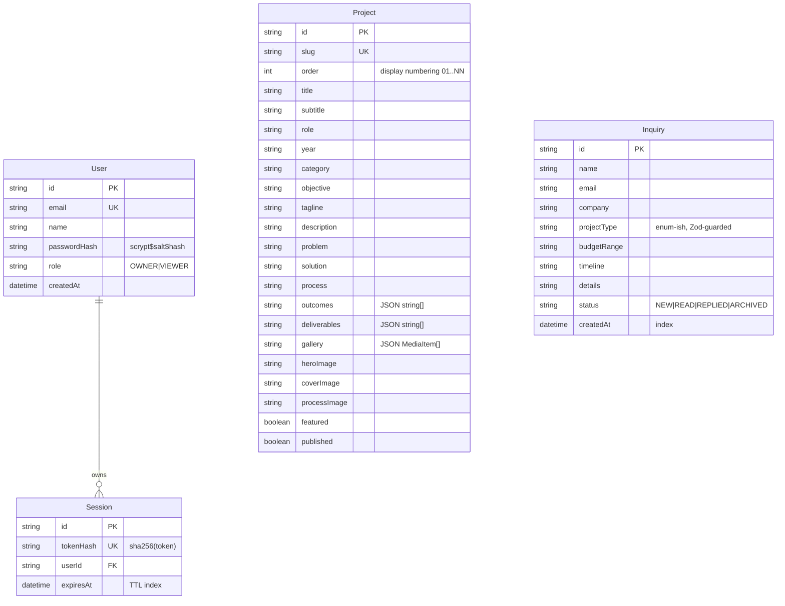

# Designer Portfolio — Master Project Architecture Document (PAD) v1.6

**Classification:** Internal Engineering Reference
**Status:** DEFINITIVE, PRODUCTION-LOCKED BLUEPRINT
**Companion Document:** [README.md](./README.md) (setup & operations), [CLAUDE.md](./CLAUDE.md) (workflow contract)
**Last Updated:** 2026-09-21
**Audience:** Senior Engineers, Tech Leads, DevOps, and Onboarding Engineers
**Rule:** Every architectural decision in this document traces to a specific rationale.

## Revision Block

| Version | Date | Author | Type | Summary |
|---|---|---|---|---|
| 1.6 | 2026-09-21 | Engineering | [CA] | Invisible radial menu remediated (operator-reported "mobile menu not working"): root causes were (1) `--charcoal` declared in `:root` but never mapped in `@theme inline`, so Tailwind v4 generated no `bg-charcoal`/`text-charcoal` utilities — the overlay, contact submit pill, hero/works gradients, and constellation tint rendered nothing; (2) `wheelCenter` returned `viewportW/2` instead of the reference bundle's `viewportW/2 − radius`, pushing every menu item off the right edge (at 390px all four anchors sat at x = 473–526). Also aligned the hover preview (no counter-rotation, matching the bundle). Unit suites 73 → 74 (mobile in-viewport reachability regression), e2e 36 → 37 (mobile radial-menu paint + geometry spec); stale screenshots 05/12/16 recaptured + 23 added |
| 1.5 | 2026-09-20 | Engineering | [CA] | Production DB provisioned by the operator (live health `ok db:true`; live E2E 23 passed / 0 failed). Contact/about DOM-parity remediation from the rendered-text drift audit: inquiry selects start empty with reference placeholders (+ friendly Zod select prompts), Social column lists all four networks with `↗` arrows, SKILL_GROUPS titles title-case in DOM (CSS uppercases), toast copy aligned ("Inquiry sent successfully." + required-fields toast), works h2 span-wrapped; unit suites 66 → 73, e2e 35 → 36 (contact parity spec) |
| 1.4 | 2026-09-20 | Engineering | [CA] | Deterministic SQLite location: `src/lib/db-path.ts` resolves relative `file:` URLs CLI-style (schema-relative, build-output-skipping) so runtime and CLI never fork the database; honest `/api/health` (real-table probe — auto-created empty files report `degraded`); seed.ts wired to the same resolution; unit suites 53 → 66 |
| 1.3 | 2026-09-20 | Engineering | [CA] | Live-deployment E2E audit (jesspete.shop: visual parity exact, DB outage diagnosed) + graceful-degradation hardening: error boundary + ErrorPanel, action-boundary outage guards (login/contact/dashboard), metadata/layout/page degradation, `e2e/outage.spec.ts` (5 specs, E2E_OUTAGE=1), docs/DEPLOYMENT.md runbook |
| 1.2 | 2026-09-20 | Engineering | [CA] | Fresh-clone hardening: dependency refresh (Next 16.3.5, Prisma 6.19.3, React 19.3), Prisma migration baseline, numeric coverage gate (100% on the pure seam), registry prune (39 unused shadcn components + dead toast hook), e2e triage-spec self-sufficiency fix; unit suites 42 → 53 |
| 1.1 | 2026-09-20 | Engineering | [CA] | Parity remediation: cinematic hero (constellation + typewriter), radial menu, ghost marquee footer, full-bleed case studies, token corrections (radius 0, cobalt/sage, 60s marquee, label-mono 0.1em), Playwright E2E suite (30 tests) + new pure-logic Vitest suites (42 total) |
| 1.0 | 2026-09-19 | Engineering | [SYN] | Initial architecture locked after full-stack build + verification |

Legend: [RES] Requirements · [SR] Security · [CA] Corrective Action · [SYN] Synthesis · [SAN] Sanity Check · [AUTH] Authorization

## Table of Contents

1. [System Overview & Decisions](#1-system-overview--decisions)
2. [High-Level System Topology](#2-high-level-system-topology)
3. [Application Architecture](#3-application-architecture)
4. [Data Architecture](#4-data-architecture)
5. [Design System Reference](#5-design-system-reference)
6. [Security Architecture](#6-security-architecture)
7. [Testing Strategy](#7-testing-strategy)
8. [Build & Deployment](#8-build--deployment)
9. [Developer Handbook](#9-developer-handbook)
10. [Known Issues & Outstanding Tasks](#10-known-issues--outstanding-tasks)
11. [Key Files Reference](#11-key-files-reference)

---

## 1. System Overview & Decisions

### 1.1 Document Metadata & Purpose

This PAD is the canonical architecture record for the Designer Portfolio application: a public portfolio gallery plus an owner dashboard, delivered as a single Next.js application. It exists so that any engineer (human or agent) can understand why the system is shaped the way it is without reverse-engineering the codebase.

### 1.2 Technology Stack Summary

| Layer | Technology | Version | Key Rationale |
|---|---|---|---|
| Framework | Next.js (App Router) | 16.3.5 | RSC-first rendering; Server Actions remove the need for a hand-rolled API layer; first-class TypeScript |
| UI runtime | React | 19.3.0 | Server Components by default keep the client bundle minimal |
| Language | TypeScript (strict) | 5.9.3 | Compile-time contract enforcement across the data boundary (`noImplicitAny` relaxed per scaffold convention) |
| Styling | Tailwind CSS | 4.3.3 | CSS-first `@theme` tokens; no runtime styling; design-token governance |
| Components | Radix UI (shadcn-style) | current | Accessible primitives (dialog, select, accordion, switch) — WCAG posture without bespoke A11y code; registry pruned to the 9 used components (regenerable via shadcn CLI) |
| Motion | Framer Motion | 12.43.0 | Declarative animation for menu/preview/gallery with reduced-motion support |
| ORM | Prisma | 6.19.3 | Typed schema; migration baseline committed (`20260920045009_init`) — `db push` and `migrate deploy` both supported |
| Database | SQLite (default), PostgreSQL-ready | — | Zero-config local/self-hosted operation; provider-portable schema |
| Validation | Zod | 4.6.5 | Single schema definition shared by client forms and server actions |
| Auth | Custom scrypt + DB sessions | — | No third-party auth dependency; portable, auditable, ~120 lines of owned code |
| Testing | Vitest · Playwright | 3.2.7 · 1.63 | Fast ESM-native unit suites (100% coverage gate on the pure seam) + real-browser E2E against the running app |
| Fonts | next/font (Inter, JetBrains Mono) | — | Self-hosted; no render-blocking external font requests |

### 1.3 Architecture Decision Records

**ADR-001 — Framework: Next.js App Router with React Server Components**
- **Context:** The portfolio needs SEO (per-project metadata, sitemap), fast first paint, and an admin area with mutations. A SPA would sacrifice SEO or require a separate SSR tier.
- **Decision:** Next.js 16 App Router; public pages are RSC; only interactive leaves are client components.
- **Rationale:** One deployable, zero API-boilerplate (Server Actions), streaming SSR, native `generateStaticParams` for project pages, `next/image` for the image-heavy gallery.
- **Consequences:** File-level conventions to respect (page export whitelist, async `params`); hydration discipline required in client islands.
- **Alternatives Rejected:** Vite SPA + separate API (SEO + deploy complexity); Remix (smaller ecosystem at decision time); Astro (weaker interactive-admin story).

**ADR-002 — Database & ORM: SQLite via Prisma, PostgreSQL-portable**
- **Context:** Single-owner deployment, low write volume (inquiries + content edits), must run anywhere without provisioning.
- **Decision:** SQLite file as the default `DATABASE_URL`; Prisma as ORM; schema avoids SQLite-specific column types.
- **Rationale:** Zero-config bootstrap (`db:push` + `db:seed`), trivial backups (copy a file), and a two-line upgrade path to PostgreSQL for concurrent deployments.
- **Consequences:** Array-typed fields are stored as JSON strings parsed at the boundary (validated helpers); in-memory rate limiting (single-instance) instead of a shared store.
- **Alternatives Rejected:** PostgreSQL-only (provisioning burden for a portfolio); Drizzle (fine, but Prisma's client DX and seed tooling matched the team's flow better).

**ADR-003 — Authentication: owned scrypt + database sessions**
- **Context:** One owner account, email/password sign-in, no interest in a managed auth vendor or OAuth dependency.
- **Decision:** `node:crypto` scrypt password hashing (`scrypt$salt$hash` format) + opaque session tokens stored as SHA-256 hashes, delivered via a signed HttpOnly cookie.
- **Rationale:** No native modules (installs anywhere), no third-party trust boundary, constant-time verification, and a database leak cannot be replayed as valid sessions.
- **Consequences:** Google OAuth renders as an honest "not configured" affordance until keys are supplied; horizontal scaling would move rate limiting and session pruning to a shared store.
- **Alternatives Rejected:** NextAuth v4 ( JWT/session indirection outweighed by its dependency surface for a single-owner app); bcrypt native binding (portability).

**ADR-004 — Mutation transport: Server Actions with an ActionResult envelope**
- **Context:** Forms (login, inquiry, project CRUD, inquiry triage) need validation, authorization, and error surfacing.
- **Decision:** All mutations are `"use server"` actions in `src/actions/`, returning `{ ok: true, data } | { ok: false, error, fieldErrors? }`. Nothing throws across the boundary.
- **Rationale:** One error contract for every form; field-level Zod errors render inline; authorization happens server-side before any data access.
- **Consequences:** No public REST mutation surface to version; the only route handler is `/api/health` (a machine contract).
- **Alternatives Rejected:** REST route handlers per resource (boilerplate + client fetch state management).

**ADR-005 — Design system: Tailwind v4 `@theme` tokens extracted from the reference app**
- **Context:** The visual language (paper/ink/cobalt, Inter + JetBrains Mono mono-labels, sage ghost grid, marquee) must be consistent and themable (light/dark).
- **Decision:** Tokens live once in `src/app/globals.css` as CSS custom properties mapped through `@theme inline`; components consume semantic classes only.
- **Rationale:** Single source of truth for color/radius/motion; dark mode is a variable swap, not a component rewrite; audit-friendly.
- **Consequences:** Hardcoding hex in components is a review-blocking violation. One documented exception: rules that must beat a `md:`/`lg:` utility at ≥1440px use unlayered CSS (`.hero-h1-scale`) because Tailwind v4 does not guarantee ascending media-block emission order for non-default breakpoints.
- **Alternatives Rejected:** CSS-in-JS (runtime cost); a separate tokens package (monorepo overhead for a single app).

**ADR-006 — Parity source of truth: the reference app's DOM + app bundle, not screenshots**
- **Context:** The public site must visually match the reference application; screenshots alone hide typography, timing, and structural detail.
- **Decision:** Every parity-sensitive class string, timer, and structure comes from the reference app's live computed styles and compiled component source; landing numbering (`01/06`) mirrors the reference's hardcoded denominator via `WORKS_TOTAL_DISPLAY`.
- **Rationale:** Computed styles are ground truth for what users see; bundle source is ground truth for why it renders that way. Sub-pixel differences (141px vs 141.12px at the exact 1440px boundary) were closed against the live app, not approximated.
- **Consequences:** When the reference changes, re-run the extraction (`scripts/extract-styles.js` pattern) and diff (see `docs/remediation-plan.md` for the method and the residual-artifact list).
- **Alternatives Rejected:** Screenshot-driven cloning (VLM-only) — misses cascade, animation timing, and a11y structure.

---

## 2. High-Level System Topology

```mermaid
flowchart TB
    subgraph Client
        V[Visitor browser]
        O[Owner browser]
    end
    subgraph Edge
        CDN[Static assets /public, .next/static]
    end
    subgraph App["Next.js 16 (single process, port 3000)"]
        RSC[RSC pages - (site)/(auth)]
        DASH[Dashboard - auth-gated]
        SA[Server Actions - Zod + session auth]
        RH[Route handler /api/health]
    end
    DB[("SQLite file db/custom.db (PostgreSQL-ready)")]
    FS[("public/projects/ media (11MB optimized)")]

    V --> CDN --> RSC --> DB
    V --> SA --> DB
    O --> RSC
    O -->|login session| DASH --> SA --> DB
    RH --> DB
    RSC --> FS
```

Runtime notes: single Node process serves SSR + actions; static assets are immutable and cache-forever candidates; the SQLite file lives beside the process (swap `DATABASE_URL` for a managed PostgreSQL when concurrency demands it).

---

## 3. Application Architecture

### 3.1 Layer Model

1. **Route layer** — `src/app/**`: pages, layouts, route handlers. Renders; never validates.
2. **Action layer** — `src/actions/**`: the only write path. Zod-validates, authorizes (session), mutates, revalidates, returns `ActionResult`.
3. **Query layer** — `src/lib/data.ts`: the only read path for pages. Maps DB rows to `ProjectView`/`InquirySummary` with validated JSON parsing.
4. **Domain/validation layer** — `src/lib/validation.ts`: schemas + types + parse/serialize helpers shared by layers 1–3.
5. **Infrastructure layer** — `src/lib/db.ts` (Prisma singleton), `src/lib/auth/*` (crypto + session), `src/lib/site-config.ts` (brand constants).

**Golden Rule:** data flows downward only — a route may call actions (on submit) and queries; actions never import from the route layer; nothing below layer 3 imports React.

### 3.2 Annotated Directory Structure

```
src/
├── app/
│   ├── (site)/                  ← public route group (shared header/footer + ghost-grid wrapper)
│   │   ├── layout.tsx           ← fetches project list for the menu; renders chrome
│   │   ├── page.tsx             ← landing: HeroConstellation, WorksSection, PhilosophySection, footer ghost marquee
│   │   ├── projects/page.tsx    ← archive with ProjectIndex client island (invert-fill rows)
│   │   ├── project/[slug]/      ← case study: ProjectHero + ProjectDetailBody (SSG + metadata)
│   │   ├── about|contact|privacy|accessibility/
│   ├── (auth)/login/page.tsx    ← sign-in (redirects authenticated users)
│   ├── dashboard/
│   │   ├── layout.tsx           ← THE AUTH GATE (redirect → /login)
│   │   ├── page.tsx             ← stats overview + recent inquiries
│   │   ├── projects/page.tsx    ← CRUD manager
│   │   └── inquiries/page.tsx   ← triage inbox
│   ├── api/health/route.ts      ← liveness/readiness probe
│   ├── globals.css              ← design tokens + utilities (ghost-grid, marquee, animated-gradient-text, hero-h1-scale)
│   ├── layout.tsx               ← fonts, theme provider, metadata, toaster
│   ├── not-found.tsx, sitemap.ts, robots.ts, icon.svg
├── actions/                     ← auth.ts, contact.ts, dashboard.ts ("use server")
├── components/
│   ├── site/                    ← site-header + radial-menu, hero-constellation, works-section,
│   │                              philosophy-section, ghost-marquee, site-footer, project-index,
│   │                              project-hero, project-detail-body, inquiry-form, fade-in
│   ├── dashboard/               ← shell/sidebar, projects manager, inquiries manager, status meta
│   ├── auth/                    ← login form
│   └── ui/                      ← shadcn/Radix primitives (pruned to the 9 the app imports:
│                                  accordion, button, dialog, input, label, select, sonner,
│                                  switch, textarea — extras regenerable via shadcn CLI)
└── lib/                         ← data.ts, validation.ts, typewriter.ts, constellation.ts,
                                   site-config.ts, db.ts, auth/
e2e/                            ← Playwright specs (6 files, 30 tests)
```

### 3.3 Critical Code Patterns

**Pattern 1 — The ActionResult envelope (never throw across the action boundary):**

```typescript
// src/lib/validation.ts — the contract every mutation honors
export type ActionResult<T = undefined> =
  | { ok: true; data: T }
  | { ok: false; error: string; fieldErrors?: Record<string, string> };

// src/actions/auth.ts — usage: validate → authorize → mutate → envelope
export async function loginAction(input: LoginInput) {
  const parsed = loginSchema.safeParse(input);
  if (!parsed.success) return failure("Please check the form.", zodFieldErrors(parsed.error));
  // … verify credentials …
  return success({ email: user.email });
}
```

*Why this pattern:* client forms render `fieldErrors` inline and mirror `error` as a toast; no try/catch sprawl; error states are typed.

**Pattern 2 — Validated JSON-in-string columns (SQLite portability):**

```typescript
// src/lib/validation.ts
export function parseGallery(json: string): MediaItem[] {
  try { return mediaItemSchema.array().parse(JSON.parse(json)); }
  catch { return []; }   // corrupt rows degrade to empty, pages never crash
}
```

*Why this pattern:* SQLite lacks native arrays; naive `JSON.parse` would let a bad row take down a whole page. The Zod round-trip also guards the write side (`serializeGallery`).

**Pattern 3 — Session auth with hashed tokens (leak-resistance):**

```typescript
// src/lib/auth/session.ts
const token = randomBytes(32).toString("base64url");            // opaque, in cookie
await db.session.create({ data: { tokenHash: sha256(token), userId, expiresAt } });
// cookie value = token + "." + sha256(token + AUTH_SECRET).slice(0,32)  (signed)
```

*Why this pattern:* a stolen database cannot be replayed as sessions (only hashes stored); a forged cookie fails the signature check before any DB hit.

**Pattern 4 — Pure interaction state machines for testable motion (typewriter, constellation, menu wheel):**

```typescript
// src/lib/typewriter.ts — pure state machine; the component only schedules timers
export type TypewriterState = { phase: "waiting" | "typing" | "pausing" | "finished"; … };
export function typewriterTick(state: TypewriterState): TypewriterState { … }

// src/lib/constellation.ts — deterministic layout derivation from project data
export function buildConstellation(sources: ConstellationSource[], …): ConstellationItem[] { … }
```

*Why this pattern:* animation logic (what to type next, where images sit, how the wheel rotates) is pure data-in/data-out — unit-tested in `tests/` without a browser or jsdom. Components only own effects (timers, listeners) and rendering. SSR ships the full markup so crawlers see the content; runtime timers enhance on top (`prefers-reduced-motion` collapses all cycling to a static, complete state).

---

## 4. Data Architecture

### 4.1 Schema (ER)



### 4.2 Data Models

- **`ProjectView`** (`src/lib/data.ts`): the read model pages consume — JSON columns already parsed into `outcomes: string[]`, `deliverables: string[]`, `gallery: MediaItem[]`.
- **`InquirySummary`**: dashboard row shape; status is a string validated by `inquiryStatusSchema` at the write boundary.
- **`SessionUser`** (`src/lib/auth/session.ts`): the authenticated principal (`id`, `email`, `name`, `role`) resolved from the cookie on every gated render.

### 4.3 Persistence Strategy

- **Write path:** server actions only, always Zod-validated, always session-authorized, with `revalidatePath` calls for affected public surfaces.
- **Seeding:** `prisma/seed.ts` is idempotent (upsert by slug for projects; owner created only when absent). Owner password comes from env — no credentials in the repo.
- **Migrations:** baseline committed (`prisma/migrations/20260920045009_init`) — `bun run db:migrate` (dev) or `bunx prisma migrate deploy` (CI/prod) reproduce the schema on a fresh clone; `db:push` remains valid for scratch iteration. SQLite `file:` URLs in `.env` resolve from the repo root (the command CWD).
- **Backups:** SQLite = copy the file; PostgreSQL = standard pg_dump.

---

## 5. Design System Reference

### 5.1 Typographic System

| Role | Family | Weights | Notes |
|---|---|---|---|
| Display/body | Inter (`next/font`) | 300–700 | Hero h1: 106px → 141px (md) → 9.8vw (≥1440px, `.hero-h1-scale`), `lineHeight: 0.82` |
| Mono labels | JetBrains Mono (`next/font`) | 300–500 | `.label-mono`: 12–14px, 0.1em tracking, uppercase — the site's signature voice |
| Ghost marquee | JetBrains Mono | 300 | 36/60/96px (`text-4xl/6xl/8xl`), uppercase, 10% opacity, `-0.025em` tracking |

### 5.2 Color Tokens (with WCAG contrast on `--background`)

| Token | Light | Dark | Usage | Contrast (light) |
|---|---|---|---|---|
| `--background` | `hsl(0 0% 96.5%)` #F6F6F6 | `hsl(0 0% 7%)` | Page surface | — |
| `--foreground` | `hsl(0 0% 7%)` #121212 | `hsl(0 0% 96.5%)` | Text | 15.3:1 AAA |
| `--muted-foreground` | `hsl(0 0% 40%)` | `hsl(0 0% 55%)` | Secondary text | 7.1:1 AA |
| `--cobalt` | `#2E5BFF` | `#2E5BFF` (unchanged) | Interactive accent, constellation dots, focus | 4.6:1 AA |
| `--sage` | `#A3B18A` | `#A3B18A` | Ghost-grid lines (20% alpha), skills dots | — |
| `--border` | `hsl(0 0% 85%)` | `hsl(0 0% 18%)` | Hairlines, editorial rules | — |
| `--destructive` | `hsl(0 84.2% 60.2%)` | `hsl(0 72% 62%)` | Error text | 4.5:1 AA |
| `--radius` | `0` | `0` | Sharp editorial corners | — |

### 5.3 Component Primitives

Radix-backed shadcn primitives in `src/components/ui/` (accordion, dialog, select, switch, label, button, input, textarea, sonner toaster). Site composites: `SiteHeader` (fixed overlay: breathing A/M logo, center theme toggle, "Start a Project →" bottom-right CTA, color-switch over dark heroes), `RadialMenu` (rotating wheel overlay on charcoal: the circle anchors at `viewportW/2 − radius` so its right arc passes through the screen center; 22°-arc items cluster on-screen at every viewport incl. 390px mobile; counter-rotated labels, projects submenu, fixed circular hover preview), `HeroConstellation` (floating project imagery + cobalt dot markers + typewriter meta), `WorksSection` (alternating sticky-parallax editorial rows, `01/06` numbering), `GhostMarquee` (giant footer band, hover-blur + pause), `ProjectIndex` (invert-fill archive rows + viewport-coords cursor preview), `ProjectHero`/`ProjectDetailBody` (full-bleed case study + sticky intro + 1↔2-column zoomable gallery), `InquiryForm` (RHF + Zod resolver, underline inputs).

### 5.4 Motion

CSS: `marquee` keyframes (60s linear, pause on hover, disabled under `prefers-reduced-motion`), `gradient-shift` (8s, on "All Projects →"), breathing logo letter-spacing (0.05em ↔ 0.7em, ~7s cycle). Framer Motion: `ease-out-expo` transitions for radial-menu reveal, works-row parallax (y 100→−100 with scroll, opacity fade band), gallery stagger (500ms, −80px viewport margin, once), typewriter cursor blink. Randomized constellation cycling (show 1.5–2.5s every 1.2–3s) collapses to a static state under `prefers-reduced-motion`.

---

## 6. Security Architecture

### 6.1 Security Rules & Enforcement

| Rule | Enforcement |
|---|---|
| All input validated at the boundary | Zod schemas in every action; `safeParse` before any DB touch |
| Passwords never stored in plaintext | scrypt with per-hash salt (`src/lib/auth/password.ts`) |
| Session tokens never stored in plaintext | SHA-256 hash column (`Session.tokenHash`) |
| Cookies are HttpOnly + SameSite=Lax + Secure (prod) | `createSession()` cookie flags |
| Cookie values are signed | `AUTH_SECRET`-keyed digest verified before DB lookup |
| Auth gate cannot be bypassed client-side | `/dashboard/*` renders only after server-side session resolution (layout gate) |
| Login brute-force throttled | 5 attempts / 10 min / email (in-memory sliding window) |
| Inquiry spam throttled | 5 submissions / hour / email + hidden honeypot field |
| Authorization on every mutation | `requireOwner()` in all dashboard actions |
| Error messages never leak internals | Generic "Invalid email or password"; envelope errors only |
| Secrets never committed | `.env` git-ignored; `.env.example` carries placeholders only |
| Admin routes hidden from crawlers | `robots.ts` disallow + `noindex` metadata on dashboard/login |

### 6.2 Security Utilities

`hashPassword`/`verifyPassword` (scrypt, timing-safe compare), `createSession`/`getCurrentUser`/`destroySession` (cookie lifecycle), `pruneExpiredSessions` (opportunistic cleanup on login), `verifyCookieValue` (signature check).

### 6.3 Auth & Authorization

Single role model today: `OWNER` (full mutation rights). `VIEWER` exists in the enum for future read-only staff; `requireOwner()` rejects non-owner mutations. Sessions expire in 30 days; expired rows are pruned on each successful login.

### 6.4 Threat Model (summary)

- **SQL injection:** none — Prisma parameterizes all queries.
- **XSS:** React escaping by default; no `dangerouslySetInnerHTML` anywhere; Zod constrains enum-ish fields.
- **Session theft:** requires both cookie exfiltration (HttpOnly mitigates) and a live DB row before expiry.
- **CSRF:** mutations are POST server actions with SameSite=Lax cookies; no state-changing GET routes.
- **Spam/bots:** honeypot + rate limit; worst case is capped junk rows in the dashboard inbox.
- **DB leak:** password hashes are salted scrypt; session tokens are hashed — neither is directly replayable.

---

## 7. Testing Strategy

### 7.1 Test Distribution

| Category | Files | Tests | Location | Framework |
|---|---|---|---|---|
| Validation schemas | 1 | 28 | `tests/validation.test.ts` | Vitest |
| Password hashing | 1 | 4 | `tests/password.test.ts` | Vitest |
| Typewriter state machine | 1 | 9 | `tests/typewriter.test.ts` | Vitest |
| Constellation layout | 1 | 9 | `tests/constellation.test.ts` | Vitest |
| Radial-menu geometry | 1 | 7 | `tests/menu-wheel.test.ts` | Vitest |
| Database-path resolution | 1 | 13 | `tests/db-path.test.ts` | Vitest |
| Site-config DOM parity | 1 | 4 | `tests/site-config-parity.test.ts` | Vitest |
| Public pages content | 1 | 7 | `e2e/public-pages.spec.ts` | Playwright |
| Project detail flows | 1 | 5 | `e2e/project-detail.spec.ts` | Playwright |
| Auth + radial menu | 1 | 6 | `e2e/auth.spec.ts` | Playwright |
| Inquiry → dashboard | 1 | 2 | `e2e/inquiry.spec.ts` | Playwright |
| Dashboard CRUD/triage | 1 | 5 | `e2e/dashboard.spec.ts` | Playwright |
| A11y / rendering smoke | 1 | 7 | `e2e/a11y-smoke.spec.ts` | Playwright |
| Outage degradation | 1 | 5 | `e2e/outage.spec.ts` | Playwright (`E2E_OUTAGE=1` only) |
| **Total** | **14** | **110** | | |

### 7.2 Test Patterns

Real behavior, no mocks: schemas parse actual payloads (valid, boundary, invalid, unknown-enum); hashing performs actual scrypt derivation and verifies round-trips, wrong passwords, and malformed stored hashes. Corrupt-JSON degradation is asserted explicitly. Interaction logic (typewriter phases, constellation positions, menu rotation clamping/counter-rotation) is extracted into pure modules so the suites drive them as data-in/data-out functions. E2E specs drive the real Chromium browser against the real server + SQLite database: mutating specs (inquiry submit, project CRUD) use unique payloads and clean up after themselves; auth-dependent specs skip when `E2E_ADMIN_PASSWORD` is unset (opt-in, no secrets in CI).

### 7.3 Coverage Thresholds

Pure domain modules (`src/lib/validation.ts`, `src/lib/auth/password.ts`, `src/lib/typewriter.ts`, `src/lib/constellation.ts`, `src/lib/menu-wheel.ts`, `src/lib/db-path.ts`) are held at **100% statements/branches/functions/lines** by a machine-enforced gate: `bunx vitest run --coverage` fails the run below threshold (`coverage.include` in `vitest.config.ts` lists exactly these files — keep it in sync when modules move). The gate ran green at 100% across all six modules with the 74-test suite.

### 7.4 Pre-PR / Pre-Deploy Checklist

```bash
bun run lint          # ESLint — exit 0
bun run typecheck     # tsc --noEmit — exit 0
bun run test          # Vitest — 74 passing
bun run build         # production build — succeeds
# server running on :3000 (dev or `bun run start`) + E2E_ADMIN_PASSWORD exported:
bunx playwright test  # Playwright — 32 passing (+5 outage under E2E_OUTAGE=1)
curl -s localhost:3000/api/health   # {"status":"ok","db":true}
```

Browser smoke is covered by the Playwright suite itself (public pages, console cleanliness, focus visibility, mobile overflow, theme toggle). Memory-constrained hosts (< ~6 GB) should run E2E against the production server (`E2E_START=1 E2E_COMMAND="bun run start"`) — the Turbopack dev server (~2.3 GB RSS) + Chromium (~2 GB) can exceed the budget and the kernel OOM-kills the server mid-run (observed and documented).

---

## 8. Build & Deployment

### 8.1 Production Build

```bash
bun run build     # next build → .next/standalone (self-contained server)
bun run start     # node .next/standalone/server.js
```

### 8.2 Environment Variables

| Name | Required | Description | Default |
|---|---|---|---|
| `DATABASE_URL` | ✅ | SQLite path or PostgreSQL URL | — (`.env.example` shows both) |
| `AUTH_SECRET` | ✅ (prod) | Cookie-signing key, ≥32 chars | dev fallback (development only) |
| `ADMIN_EMAIL` | — | Seed owner email | `admin@alexmoreau.design` |
| `SEED_ADMIN_PASSWORD` | first seed | Owner password, ≥8 chars | — |
| `NEXT_PUBLIC_SITE_URL` | ✅ (prod) | Canonical origin (metadata/sitemap) | `http://localhost:3000` |
| `GOOGLE_CLIENT_ID/SECRET` | — | OAuth keys for the Google button | unset → honest notice |
| `E2E_ADMIN_EMAIL/E2E_ADMIN_PASSWORD` | — | Playwright login credentials (specs skip when unset) | — |
| `E2E_START`/`E2E_COMMAND`/`E2E_PORT`/`E2E_BASE_URL` | — | Playwright server-management knobs | dev server on :3000 |

### 8.3 Docker

Not shipped (single-process Node app; `node .next/standalone/server.js` is the runtime). A minimal Dockerfile (node:22-alpine, copy standalone + `public/` + `prisma/`, `db:push` on boot) is the intended containerization path.

### 8.4 CI/CD

No hosted CI yet — the local gate (§7.4) is the only gate, matching the repo's push contract. Adding GitHub Actions: run the §7.4 sequence on `push`/`pull_request` with Node 22 + `bun install`.

---

## 9. Developer Handbook

### 9.1 Local Setup

```bash
bun install
cp .env.example .env    # set AUTH_SECRET + SEED_ADMIN_PASSWORD
bun run db:push && bun run db:seed
bun run dev
```

### 9.2 Common Commands

| Command | Location | Purpose |
|---|---|---|
| `bun run dev` | repo root | Dev server :3000 (log → `dev.log`) |
| `bun run lint` / `typecheck` / `test` | repo root | Quality gate |
| `bunx playwright test` | repo root | E2E suite (server on :3000; `E2E_ADMIN_PASSWORD` to unlock auth specs) |
| `bun run db:push` / `db:generate` / `db:seed` | repo root | Schema + client + seed |
| `bunx vitest run -t "<name>"` | repo root | Single unit test |

### 9.3 Code Style Rules

TypeScript strict, no `any` (`unknown` + narrowing); `interface` for shapes, `type` for unions; early returns; actions return envelopes; design tokens only (no hardcoded hex); comments explain why.

### 9.4 Git Workflow

`main` + short-lived `feat/*`/`fix/*`; Conventional Commits (`feat(inquiries): …`); atomic commits; never commit `.env`, `db/*.db`, `dev.log`.

---

## 10. Known Issues & Outstanding Tasks

| Priority | Issue | Impact | Status |
|---|---|---|---|
| Low | In-memory rate limiting (login + inquiries) | Resets on restart; per-instance when scaled out | Accepted (single-instance deployment; swap for a shared store when horizontal) |
| Low | Google OAuth affordance is inert | Owner must use email/password | By design (honest-unconfigured pattern; wire `GOOGLE_*` env + provider to activate) |
| Info | One gallery item is a 720p MP4 | ~0.8 MB, lazy `preload="metadata"` | Accepted |
| Info | Landing numbering shows `01/06` with 5 published projects | Intentional parity: the reference app hardcodes 6 (`WORKS_TOTAL_DISPLAY` in `src/lib/site-config.ts`) | Documented (matches reference exactly) |
| Info | Reference app uses GSAP ScrollSmoother (inertia scroll); this app uses native scroll + framer-motion reveals | Scroll physics differ subtly; layout and reveal choreography match | Deferred by design (avoids a GSAP dependency; native scroll is more accessible) |
| Info | Reference is a client-rendered SPA; this app is RSC-first with DB persistence and a dashboard the reference lacks | Architectural divergence is intentional | Documented (see ADR-001, ADR-006) |
| Info | `/login` follows this site's design system instead of the reference's Base44 platform login widget (rounded card, system fonts, avatar) | Login screen is visually custom but functionally equivalent (Email/Password, Google affordance, forgot/sign-up links all present) | Deliberate: the reference's login is platform boilerplate that contradicts the app's own radius-0 / Inter / JetBrains-Mono tokens; the clone keeps the design language coherent |
| Info | Project-detail `<title>` is the generic `Project Detail \| Designer Portfolio` | Browser-tab title matches the reference exactly (per-project titles remain in OG/meta tags, which the reference lacks) | Parity fix (session 3) |
| Info | Computed `font-family` reports `Inter, "Inter Fallback"` / `"JetBrains Mono", "<name> Fallback"` (Next 16.3+ metric-fallback stacks) vs the reference's plain `Inter, sans-serif` | Extraction-level string only; rendered glyphs identical (live pixel diff: mean 0.36/255, 98.9% identical) | Documented artifact (session 8) — ignore in computed-style diffs |
| ~~High~~ Resolved | **Production deployment (`jesspete.shop`) database** — resolved session 14: the operator provisioned the production data layer and redeployed; live `/api/health` reports `ok db:true` and the read-only live E2E smoke passes 23/23 applicable specs (12 password-gated specs skip). Root cause history: session 12 pinned the runtime SQLite resolution to CLI semantics and made health probe a real table; the operator then followed `docs/DEPLOYMENT.md` | Live site fully functional (auth, inquiries, dashboard, SSG pages from real data) | **Closed** — future drift detection: re-run `E2E_BASE_URL=https://designer-portfolio.jesspete.shop bunx playwright test` after each deploy |
| Info | `error.tsx` cannot catch errors from `generateMetadata` or the dynamicParams **fallback render path** (Next bypasses React error boundaries there) | A naive unguarded data call in those paths still yields a bare 500 | Mitigated in code: metadata/layout/page-level guards render the styled ErrorPanel (session 10); keep new SSG pages' data calls guarded the same way |

## 11. Key Files Reference

| File | Lines (approx.) | Purpose |
|---|---|---|
| `src/lib/validation.ts` | ~170 | Zod schemas, ActionResult, JSON-column helpers — the domain contract |
| `src/lib/auth/session.ts` | ~120 | Session create/resolve/destroy, cookie signing |
| `src/lib/auth/password.ts` | ~40 | scrypt hash/verify |
| `src/lib/typewriter.ts` | ~60 | Pure typewriter state machine (hero meta line) |
| `src/lib/constellation.ts` | ~90 | Pure constellation layout derivation (hero imagery) |
| `src/lib/data.ts` | ~160 | All read queries + view models |
| `src/lib/db-path.ts` | ~90 | Deterministic SQLite URL resolution (CLI parity: schema-relative anchoring, build-output skipping) — wired into `db.ts` + `seed.ts` |
| `src/actions/auth.ts` | ~75 | Login/logout (+ throttle) |
| `src/actions/contact.ts` | ~75 | Public inquiry submission (+ honeypot, rate limit) |
| `src/actions/dashboard.ts` | ~160 | Projects CRUD + inquiry triage (owner-gated) |
| `src/app/globals.css` | ~260 | Design tokens, ghost-grid, marquee, animated-gradient-text, hero-h1-scale |
| `prisma/schema.prisma` | ~100 | Data model |
| `prisma/seed.ts` | ~300 | Idempotent seed (content + owner) |
| `src/components/site/site-header.tsx` | ~110 | Fixed overlay chrome: breathing logo, center toggle, CTA |
| `src/components/site/radial-menu.tsx` | ~200 | Rotating radial menu wheel overlay |
| `src/components/site/hero-constellation.tsx` | ~260 | Constellation hero + typewriter meta |
| `src/components/site/works-section.tsx` | ~120 | Alternating sticky-parallax rows |
| `src/components/site/ghost-marquee.tsx` | ~60 | Giant footer marquee band |
| `src/components/site/project-index.tsx` | ~200 | Archive rows: invert-fill + cursor preview |
| `src/components/site/project-detail-body.tsx` | ~180 | Sticky intro + 1↔2-col zoomable gallery |
| `playwright.config.ts` | ~55 | E2E config (chromium-only, reuse-or-manage server, OOM guidance) |
| `src/components/dashboard/dashboard-shell.tsx` | ~170 | Sidebar + sign-out chrome |
