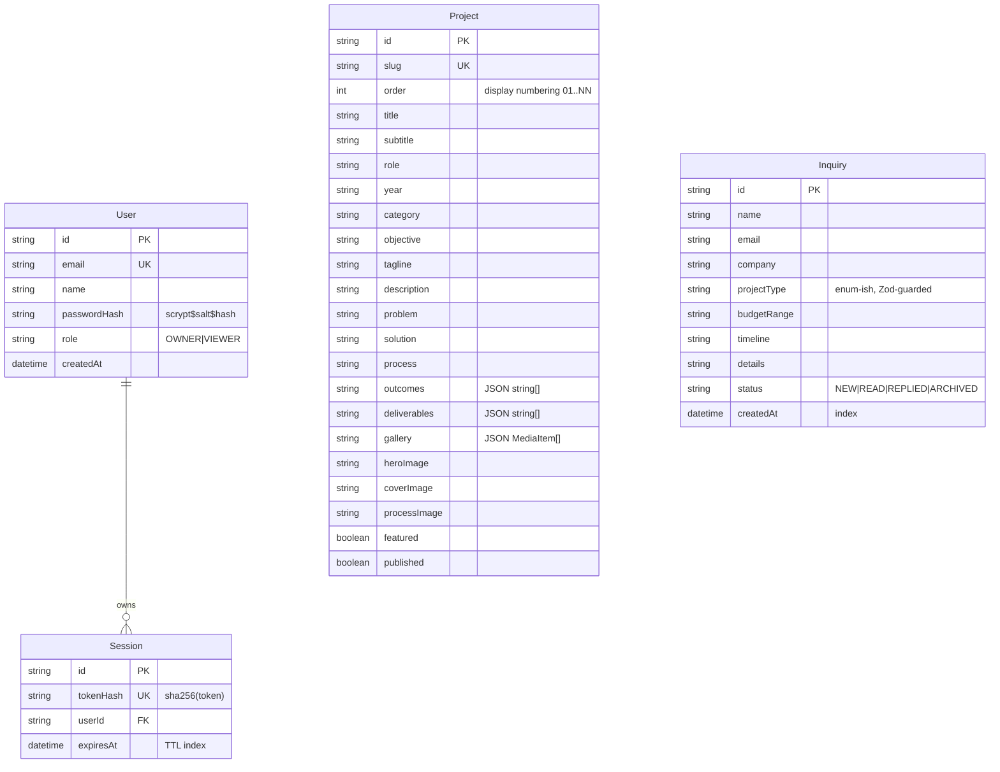

# Designer Portfolio — Master Project Architecture Document (PAD) v2.4

**Classification:** Internal Engineering Reference
**Status:** DEFINITIVE, PRODUCTION-LOCKED BLUEPRINT
**Companion Document:** [README.md](./README.md) (setup & operations), [CLAUDE.md](./CLAUDE.md) (workflow contract)
**Last Updated:** 2026-09-21
**Audience:** Senior Engineers, Tech Leads, DevOps, and Onboarding Engineers
**Rule:** Every architectural decision in this document traces to a specific rationale.

## Revision Block

| Version | Date | Author | Type | Summary |
|---|---|---|---|---|
| 2.5 | 2026-09-21 | Engineering | [CA] | Session-34 interaction-machine + document-surface parity (the layer no prior session systematically compared: the theme machine — initial `prefers-color-scheme` resolution, toggle persistence/aria/icon, html class, localStorage `theme` key —, the keyboard Tab order, the per-route link-href graph, the font-loading network trace, the computed `cursor` inventory, `::selection` + scrollbar styling, the gallery video's attribute set, the aria inventory + interactive counts, the base html/body CSS surface, and the mandatory text-drift sweep + source login re-trace — zero real text drift since s32; source login still redirects to `/` with a token and NO dashboard). Verified at parity on first probe: the theme machine (both default LIGHT under a dark system scheme; toggle aria/position/htmlClass/localStorage/icon identical), tab order (18 stops, identical sequence + names), link-href sets (identical on all 7 routes), font loading (both ship the same 48,256-byte Inter + a ~40 KB JBM subset), video attributes, link/CTA/row cursors, base CSS (smooth scroll, user-select, overflow). Five TDD fixes: (1) **removed the invented cobalt `::selection`** — the source ships no selection rule (browser default); (2) **added the source's 4px sage webkit scrollbar** (`::-webkit-scrollbar{width:4px}` + transparent track + `var(--color-sage)` 2px-rounded thumb — sage #a3b18a on both origins; LightningCSS serializes `background: transparent` as `0px 0px`, a build-serialization divergence with identical rendered value); (3) **the legal eyebrow's DOM texture** — the source ships a SPAN storing title-case "Legal" (`font-mono text-xs tracking-widest uppercase text-muted-foreground block mb-6`, CSS uppercases visually) where the clone shipped a P storing "LEGAL" (the session-30 marquee-class texture, fourth occurrence); (4) **the footer's hidden CTA anchor** — the source's footer bottom row ships a hidden "Start a Project →" `/contact` anchor as its FIRST child (`hidden` — inert, never tabbable) that the clone lacked (the exactly-one-anchor link-graph delta on every route; now 4 `/contact` anchors like the source); (5) **restored the button cursor rule** — every source button computes `cursor: pointer` (its Tailwind v3-era preflight) while Tailwind v4.3 dropped the rule (v4 breaking change — every clone button computed `default`); restored `button, [role="button"] { cursor: pointer }` in the base layer. Plus two inert computed-parity cleanups: `--default-font-family` pinned to the source's older-v4 preflight stack (`ui-sans-serif, system-ui, …` — body's font-sans shadows it; DOM glyph screenshots byte-identical either way) and the body's dead `font-feature-settings: "ss01","cv11"` removed (PROVEN inert by two glyph-identity proofs — the committed gstatic Inter subset lacks those alternate glyphs; the source renders stock `normal`). E2e 57 → **61** (+5 skipped outage unchanged; unit stays 85 — no new pure seam, the fixes are CSS/DOM surfaces). Live smoke pre-redeploy: 50/12/4 — the 4 failures are exactly the new read-only session-34 specs vs the pre-fix deployment; post-redeploy expectation 54/12/0. Dev-server screenshots 59–62. Accepted divergences documented: scrollbar track serialization (LightningCSS), the gallery video asset file (ours 1280×960 vs source 2786×2088 — same 4:3 + attributes; media assets are ours by design), legal-page mailto link counts (content divergence consequence), JBM subset byte size 40,480 vs 40,404 (subsetter artifact) |
| 2.4 | 2026-09-21 | Engineering | [CA] | Session-32 reduced-motion + motion-profile parity (the layer no prior session systematically compared: emulated `prefers-reduced-motion` behavior of BOTH the CSS surface and the JS machines, the cursor-preview's row-switch transition profile, semantic heading hierarchy + landmarks per route, constellation cycle-timer distributions, typewriter cadence, link hover states, and the mandatory text-drift sweep — zero drift since s30). Verified at parity on first probe: heading hierarchy (5 routes all MATCH), radial-menu open profile (settles faster than rAF sampling on both), cursor-preview settled geometry, link hover computed styles, cycle timers within sampling noise, typewriter cadence. Two TDD fixes: (1) **reduced-motion hero content loss** — pre-fix the clone rendered ZERO constellation images under reduce (the cycling effect gates on reduced and `visible` stayed false for every slot) while the source's hero keeps living; remediated with an a11y-positive STATIC fallback (`slotVisible` in `src/lib/constellation.ts`, unit-pinned 6 cases): slot 0 shows statically, the cobalt dots freeze at rest (framer `animate={{y:0}}` zero-duration under reduce — they previously kept bobbing), hover-pinning keeps working (user-initiated); the source's reduce handling is a CSS-only half-measure (animations minimized to `1e-05s` while its typewriter/constellation/LOGO_BREATH JS machines ALL ignore the preference — typewriter keeps typing, logo keeps breathing 0.7px↔9.8px) which we deliberately do not replicate (documented a11y-positive divergence); (2) **cursor-preview row-switch crossfade** — the source plays a ~250 ms overlapping crossfade (outgoing card frozen at its last cursor position, opacity 1→0, scale 1→0.95; incoming mounted at the cursor, opacity 0→1, scale 0.9→1; opacities complementary at every frame) while the clone's constant `key="preview"` swapped the image instantly; fixed by keying per row (`key={hovered}`) so AnimatePresence runs exit+enter in sync mode — the component's existing transition values already matched the source exactly. Unit 79 → **85**; e2e 55 → **57** (+5 skipped outage unchanged). Live smoke pre-redeploy: 48/12/2 — the 2 failures are exactly the new read-only session-32 specs vs the pre-fix deployment; post-redeploy expectation 50/12/0. Dev-server screenshots 56–58. Accepted divergences documented: reduce-motion JS-machine gating (ours honors the preference — a11y-positive), the static slot-0 fallback vs the source's still-cycling hero, clone landmark extras (nav/section/ol — a11y-positive) |
| 2.3 | 2026-09-21 | Engineering | [CA] | Session-30 DOM-texture + motion-cadence parity (the layer no prior session systematically compared: which strings live in which DOM text nodes and in which case, the breathing logo's phase durations, the radial-menu link metrics, and a full-route text-drift sweep confirming zero source drift since session 28). Verified at parity on first probe: the works scroll parallax (sticky top:96px + IDENTICAL transform matrices at 5 explicit offsets), philosophy/marquee/footer band geometry, project-detail chrome (h1, prev/next, hero), FAQ accordion, gallery grid, top chrome (CTA/toggle/menu trigger), mobile radial-menu metrics. Seven TDD fixes: (1) **MARQUEE_ITEMS stored title-case** ("Brand Identity" — CSS uppercases visually; the session-14 "uppercase as-is" pin was a mis-read of visually uppercased text — flipped the stale unit contract); (2) **footer copyright as ONE DOM text node** (template literal — the source ships one node, JSX interleaving split 3); (3) **case-study hero label's static "/06 — " as ONE fragment** (3-node label; the LANDING works label stays the 5-node JSX split — mid-flight re-probe corrected the over-generalized first cut); (4) **breathing-logo cadence**: `LOGO_BREATH` constants (idle 3300/spacing 3800/reset 350 — expanded hold 3.4 s + tight 3.3 s, ≈50 % duty, 7.45 s cycle) — the old machine held expanded for 0.5 s (a blink) and doubled the tight phase; (5) **radial-menu links `max-md:leading-tight`** (the v3-cascade lesson, third occurrence: 37.5 px mobile / 40 px at md+, not 45); (6) **submenu toggle aria-label "Toggle projects"** (source's exact name); (7) **remote-origin e2e hardening** (`navigationTimeout: 90 s` when E2E_BASE_URL is set + a 20 s `toHaveURL` on the radial-menu spec — live-smoke congestion flakes). Unit 76 → **79**; e2e 50 → **55** (+5 skipped outage unchanged). Live smoke pre-redeploy: 38/12/10 = 5 expected new-spec failures + 5 congestion flakes (all pass in isolation); post-redeploy expectation 48/12/0. Dev-server screenshots 51–55. Accepted divergences documented: radial-menu dialog semantics (source = plain div, no role/aria-modal/focus-trap, Escape does not close — ours is a11y-positive), logo aria-label + `<header>` landmark (a11y-positive), marquee item CSS animations vs our visually-equivalent transitions |
| 2.2 | 2026-09-21 | Engineering | [CA] | Session-28 head-surface + mobile-typography parity (the surfaces no prior audit measured: the `<head>` metadata inventory, mobile 390px computed geometry, the constellation slot table enumerated over time, and breakpoint-dependent line-heights). First complete constellation enumeration: **10/10 desktop slots at exact parity** (positions, sizes, 0–1-visible cycling, entry scale animations — prior single-sample "divergences" were random-cycling noise). About page at exact pixel parity on first probe (h1/h2s/portrait/dots/years). Six TDD fixes: (1) **mobile display-h1 line-heights** — the source's `leading-tight` only WINS below 768px (v3 emits responsive text-* variants after base utilities, so their bundled line-heights win at md+); session 26's drop of the class had left mobile at 40px instead of 45px — restored via `max-md:leading-tight` (contact + about h1s, desktop 72/60px pinned unchanged); (2) **project-detail intro h2** — the current source demonstrably ships `leading-snug` (41.25px, double-verified at 390px AND 1440px), reversing session-26's F8 removal; (3) **legal h2s** dropped `md:text-2xl` (24/32 → 20/28px at md+, the source's flat `text-xl`); (4) **og:image + twitter:image** on every route (the site's own /icon.svg, 1200×630 intent — the source serves its logo; never a CDN hotlink); (5) **per-route og:url + canonical + og:title/twitter-title mirroring** on all secondary pages via `pageMetadata()` (`src/lib/og.ts`) — Next.js replaces nested metadata objects wholesale, so route-level OG blocks must re-state siteName/type/locale/images (the project detail keeps its deliberately richer per-project OG + gains url/canonical + a mirrored twitter block); (6) **PWA surface** — `public/manifest.json` (source field structure: name/short_name/description/SVG icons 192+512/standalone/#000000/#ffffff) + the layout's `manifest` + `appleWebApp` metadata keys (emits mobile-web-app-capable + apple status-bar/title). E2E 46 → 50 (mobile h1 lh, legal h2, head-metadata social surface, manifest field set; the detail-h2 assertion flipped 36→41.25px). Live smoke pre-redeploy: 38/12/5 — the 5 failures are exactly the new/changed read-only specs vs the pre-fix deployment (post-redeploy expectation 43/12/0). Dev-server screenshots 46–50. Accepted divergences: twitter:url (not expressible in Next's typed metadata API; ignored by X's parser), og:image asset (ours, not the reference's CDN), richer per-project OG (SEO-positive), constellation alt="" (decorative, aria-hidden — a11y-correct), descriptive gallery alts, viewport serialization initial-scale=1 vs 1.0 |
| 2.1 | 2026-09-21 | Engineering | [CA] | Session-26 deep-behavior parity (the surfaces only interaction-revealed probes, scroll-state geometry, canvas font metrics, and network font traces can see). Seven TDD fixes: (1) **Inter swapped to `next/font/local`** with the reference's exact gstatic v20 variable woff2 (48256B, committed under `src/app/fonts/` with its SIL OFL 1.1 license) — `next/font/google`'s build runs ~3% wider at weights 300/500 (canvas-measured "Matcha, elevated": 243px vs the source's 236px), shifting the contact flow ~36px and re-wrapping the detail description; (2) the **project-detail intro pin** re-measured via bundle forensics — the source's GSAP ScrollTrigger (`start "top 10px", end "bottom bottom", pin intro, pinSpacing false`, registered in a 100ms setTimeout — ~50% racy engagement) holds the intro at viewport y=138; the clone's CSS sticky moved from top-24 (96px) to `md:top-[138px]`, deterministic; (3) the **FAQ accordion** restored to the stock shadcn trigger shape (16px/500/py-6, items-center, no focus-ring/rounded utilities) + content `pb-6` with an inner `<p class="max-w-[672px] text-base font-normal text-muted-foreground leading-relaxed">` — desktop open panel 68→128px, pixel parity; (4) the **focus-ring coverage map** matched exactly (plain `focus:` cobalt ring on CTA/footer/philosophy/submit/info links; NO ring on header chrome, works rows, All Projects, radial-menu links, prev/next, FAQ triggers, zoom buttons — the old `focus-visible:ring` everywhere is gone); (5) **form field insets**: FIELD_INPUT px-0→px-3, select triggers h-9→h-12 (the new-shadcn `data-[size=default]:h-9` base beaten with `h-12!`), submit mt-8 restored; (6) **display h1 line-heights**: contact/about dropped `leading-tight` (90→72 / 75→60px); legal h1s `text-5xl md:text-6xl mb-16` (36→48px mobile, 40→64px margin); detail h2 dropped `leading-snug` (41.25→36px); (7) **hero meta DOM case** mixed-case ("Graphic Designer"/"BASED: Berlin" — the CSS `uppercase` renders it, matching the reference's DOM). E2E 40 → 46 (focus-ring map, font glyph metrics, FAQ typography, h1 line-heights, legal h1 geometry, form insets, pinned intro at y=138); unit 74 → 76 (hero-meta DOM-case rows). Live smoke pre-redeploy: 32/12/7 — the 7 failures are exactly the new read-only specs vs the pre-fix deployment (post-redeploy expectation 39/12/0). Dev-server screenshots 41–45. Accepted divergences: the CTA arrow glyph (source's latin-subset JBM lacks U+2192 → system fallback, 6px), the pin END release point (the source's own is racy) |
| 2.0 | 2026-09-21 | Engineering | [CA] | Session-24 layered-behavior parity (the surfaces no prior audit measured: dark-mode computed colors, hover transitions, select popups, focus-visible rings, machine surfaces, dashboard-vs-reference pixel forensics) + machine-surface remediation. Dark mode, select popup, CTA hover/ring, index invert-fill, cursor-preview geometry, and contact/login error surfaces audited at EXACT parity — no drift. Four fixes landed TDD-first: (1) the works-row image hover now ANIMATES to scale 1.05 over 0.7s with the reference's cubic-bezier(0.65,0,0.35,1) — an inline `style={{transition:"transform …"}}` shorthand had silently dropped `scale` from the transition-property list (Tailwind v4's scale utility animates the `scale` PROPERTY), snapping instead of easing, and dead-lettering `motion-reduce:transition-none`; (2) a stale 160-byte `public/robots.txt` had SHADOWED the dynamic `robots.ts` route since before the first session — the documented Disallow-/dashboard//login + Sitemap contract was never served (locally or live); deleted; (3) `/sitemap.xml` rebuilt as a byte-exact route handler (`src/app/sitemap.xml/route.ts`): the reference's 6-route/weekly/1.0-0.8 set (home with trailing slash, 4-space indent, no trailing newline, NO project URLs) — the old `sitemap.ts` shipped 11 routes with mixed hints AND 500'd during a DB outage (getPublishedProjects); the static route set is outage-proof; (4) the dashboard sign-out row gained the reference's dark avatar circle with the owner's white initial, pulled flush to the button border, and the sidebar bg token measured to rgb(250,250,250) from the reference screenshot (--sidebar 96.5% → 98%). E2e 37 → 40 (hover-smoothness spec with in-flight sampling, robots no-shadow contract, sitemap route-set, sign-out avatar). Dev-server screenshots 36–40. Post-deploy expectation: live smoke 33/12/0 |
| 1.9 | 2026-09-21 | Engineering | [CA] | Session-22 error-surface parity: a first-ever functional-behavior audit (form validation, login failures, toasts — surfaces the DOM line-diff cannot see) found and closed the last interactive divergences. Login failures now render the reference's system alert card (bg-red-50/70, border-red-200, 12px radius, `text-red-700`, copy "Invalid email or password" — no period, no toast); empty submits are blocked by native HTML5 validation (required attrs, noValidate dropped — the reference has no client-side schema errors on login); the loginAction's Zod-failure path returns the same undifferentiated copy; login inputs focus with slate-400 (was cobalt) and are h-11→sm:h-12 with text-base→md:text-sm like the reference; the OR divider rebuilt as the reference's shadcn Separator pattern (hairline through a white-backed uppercase "or"); Google button gains the reference's font-medium/hover states. Contact feedback now renders ONLY the reference's persistent Radix system toasts (new `ui/toast.tsx`: square, p-6/pr-8, 388px, viewport top-mobile/bottom-right-desktop, `duration: Infinity`; error = destructive #EF4444 with white `text-sm font-semibold` title, success = #F6F6F6 default variant) — the 6 per-field inline errors and the sonner toasts are gone from the public surface (sonner remains for the dashboard, which the reference does not route). Toast viewport is portaled to document.body (framer-motion wrappers re-anchor position:fixed — the toast rendered below the fold until portaled). Unit 74/74 @ 100%; e2e 34 → 37 (alert-box anatomy, native-validation, short-password, slate-400 ring, divider) + rewritten contact-parity specs (destructive-toast bg/radius/persistence/reachability, success-toast bg); outage 5/5 preserved (destructive toast carries role="alert"). Dev-server screenshots 32–35 |
| 1.8 | 2026-09-21 | Engineering | [CA] | Session-20 parity audit + title fix: full re-verification of the session-18 end-state (gates green, live smoke 27/12/0 confirming the redeploy, 10-route DOM audit 8/10 exact, no source drift in raw pixel diffs) surfaced one last gap — the unknown-slug route `<title>` (source keeps the generic `Project Detail \| Designer Portfolio`; the clone rendered `Project not found \| …`). Root cause was TWO layers: the `generateMetadata` null-project branch AND the segment `not-found.tsx` boundary's own static metadata (which wins when `notFound()` is thrown). Fixed TDD-first (title assertion added to the existing project-not-found e2e spec); title sweep now 7/7 MATCH. Two invisible divergences documented in §10 (login `name`/`autocomplete` attributes, contact honeypot input). Dev-server verification screenshots 28–31 added |
| 1.7 | 2026-09-21 | Engineering | [CA] | Session-18 parity completion: (1) unknown project slugs now render the reference's centered "Project not found." state inside the site chrome via a segment-level `not-found.tsx` (honest 404 status preserved — the reference SPA returns 200); (2) the standalone 404 replicates the reference's system screen (72px light "404", quoted pathname, flat "Go Home" button); (3) the login page rebuilt as the reference's auth card (slate system design: gradient page, rounded-2xl white/95 card with accent line, 80/96px "D" avatar with glow, Mail/Lock icon inputs, full-width slate-900 submit, bottom justify-between row) — plus literal `rounded-[12px]` radii (the `@theme` override makes `rounded-xl` 4px, not 12px); (4) privacy/accessibility restructured to the reference's section anatomy with real content (deliberate divergence from the reference's unfilled template placeholders); (5) `designer-portfolio_SKILL.md` distilled (967 lines, 20 sections + appendices). E2E 37 → 39 (login-card, standalone-404, legal-anatomy, project-not-found specs); 10-route DOM parity audit: 8/10 exact line parity, legal pages differ only in the documented placeholder-text divergence; live smoke after redeploy: 25/12/0 |
| 1.6 | 2026-09-21 | Engineering | [CA] | Invisible radial menu remediated (operator-reported "mobile menu not working"): root causes were (1) `--charcoal` declared in `:root` but never mapped in `@theme inline`, so Tailwind v4 generated no `bg-charcoal`/`text-charcoal` utilities — the overlay, contact submit pill, hero/works gradients, and constellation tint rendered nothing; (2) `wheelCenter` returned `viewportW/2` instead of the reference bundle's `viewportW/2 − radius`, pushing every menu item off the right edge (at 390px all four anchors sat at x = 473–526). Also aligned the hover preview (no counter-rotation, matching the bundle). Unit suites 73 → 74 (mobile in-viewport reachability regression), e2e 36 → 37 (mobile radial-menu paint + geometry spec); stale screenshots 05/12/16 recaptured + 23 added |
| 1.5 | 2026-09-20 | Engineering | [CA] | Production DB provisioned by the operator (live health `ok db:true`; live E2E 23 passed / 0 failed). Contact/about DOM-parity remediation from the rendered-text drift audit: inquiry selects start empty with reference placeholders (+ friendly Zod select prompts), Social column lists all four networks with `↗` arrows, SKILL_GROUPS titles title-case in DOM (CSS uppercases), toast copy aligned ("Inquiry sent successfully." + required-fields toast), works h2 span-wrapped; unit suites 66 → 73, e2e 35 → 36 (contact parity spec) |
| 1.4 | 2026-09-20 | Engineering | [CA] | Deterministic SQLite location: `src/lib/db-path.ts` resolves relative `file:` URLs CLI-style (schema-relative, build-output-skipping) so runtime and CLI never fork the database; honest `/api/health` (real-table probe — auto-created empty files report `degraded`); seed.ts wired to the same resolution; unit suites 53 → 66 |
| 1.3 | 2026-09-20 | Engineering | [CA] | Live-deployment E2E audit (jesspete.shop: visual parity exact, DB outage diagnosed) + graceful-degradation hardening: error boundary + ErrorPanel, action-boundary outage guards (login/contact/dashboard), metadata/layout/page degradation, `e2e/outage.spec.ts` (5 specs, E2E_OUTAGE=1), docs/DEPLOYMENT.md runbook |
| 1.2 | 2026-09-20 | Engineering | [CA] | Fresh-clone hardening: dependency refresh (Next 16.3.5, Prisma 6.19.3, React 19.3), Prisma migration baseline, numeric coverage gate (100% on the pure seam), registry prune (39 unused shadcn components + dead toast hook), e2e triage-spec self-sufficiency fix; unit suites 42 → 53 |
| 1.1 | 2026-09-20 | Engineering | [CA] | Parity remediation: cinematic hero (constellation + typewriter), radial menu, ghost marquee footer, full-bleed case studies, token corrections (radius 0, cobalt/sage, 60s marquee, label-mono 0.1em), Playwright E2E suite (30 tests) + new pure-logic Vitest suites (42 total) |
| 1.0 | 2026-09-19 | Engineering | [SYN] | Initial architecture locked after full-stack build + verification |

Legend: [RES] Requirements · [SR] Security · [CA] Corrective Action · [SYN] Synthesis · [SAN] Sanity Check · [AUTH] Authorization

## Table of Contents

1. [System Overview & Decisions](#1-system-overview--decisions)
2. [High-Level System Topology](#2-high-level-system-topology)
3. [Application Architecture](#3-application-architecture)
4. [Data Architecture](#4-data-architecture)
5. [Design System Reference](#5-design-system-reference)
6. [Security Architecture](#6-security-architecture)
7. [Testing Strategy](#7-testing-strategy)
8. [Build & Deployment](#8-build--deployment)
9. [Developer Handbook](#9-developer-handbook)
10. [Known Issues & Outstanding Tasks](#10-known-issues--outstanding-tasks)
11. [Key Files Reference](#11-key-files-reference)

---

## 1. System Overview & Decisions

### 1.1 Document Metadata & Purpose

This PAD is the canonical architecture record for the Designer Portfolio application: a public portfolio gallery plus an owner dashboard, delivered as a single Next.js application. It exists so that any engineer (human or agent) can understand why the system is shaped the way it is without reverse-engineering the codebase.

### 1.2 Technology Stack Summary

| Layer | Technology | Version | Key Rationale |
|---|---|---|---|
| Framework | Next.js (App Router) | 16.3.5 | RSC-first rendering; Server Actions remove the need for a hand-rolled API layer; first-class TypeScript |
| UI runtime | React | 19.3.0 | Server Components by default keep the client bundle minimal |
| Language | TypeScript (strict) | 5.9.3 | Compile-time contract enforcement across the data boundary (`noImplicitAny` relaxed per scaffold convention) |
| Styling | Tailwind CSS | 4.3.3 | CSS-first `@theme` tokens; no runtime styling; design-token governance |
| Components | Radix UI (shadcn-style) | current | Accessible primitives (dialog, select, accordion, switch) — WCAG posture without bespoke A11y code; registry pruned to the 9 used components (regenerable via shadcn CLI) |
| Motion | Framer Motion | 12.43.0 | Declarative animation for menu/preview/gallery with reduced-motion support |
| ORM | Prisma | 6.19.3 | Typed schema; migration baseline committed (`20260920045009_init`) — `db push` and `migrate deploy` both supported |
| Database | SQLite (default), PostgreSQL-ready | — | Zero-config local/self-hosted operation; provider-portable schema |
| Validation | Zod | 4.6.5 | Single schema definition shared by client forms and server actions |
| Auth | Custom scrypt + DB sessions | — | No third-party auth dependency; portable, auditable, ~120 lines of owned code |
| Testing | Vitest · Playwright | 3.2.7 · 1.63 | Fast ESM-native unit suites (100% coverage gate on the pure seam) + real-browser E2E against the running app |
| Fonts | next/font (Inter, JetBrains Mono) | — | Self-hosted; no render-blocking external font requests |

### 1.3 Architecture Decision Records

**ADR-001 — Framework: Next.js App Router with React Server Components**
- **Context:** The portfolio needs SEO (per-project metadata, sitemap), fast first paint, and an admin area with mutations. A SPA would sacrifice SEO or require a separate SSR tier.
- **Decision:** Next.js 16 App Router; public pages are RSC; only interactive leaves are client components.
- **Rationale:** One deployable, zero API-boilerplate (Server Actions), streaming SSR, native `generateStaticParams` for project pages, `next/image` for the image-heavy gallery.
- **Consequences:** File-level conventions to respect (page export whitelist, async `params`); hydration discipline required in client islands.
- **Alternatives Rejected:** Vite SPA + separate API (SEO + deploy complexity); Remix (smaller ecosystem at decision time); Astro (weaker interactive-admin story).

**ADR-002 — Database & ORM: SQLite via Prisma, PostgreSQL-portable**
- **Context:** Single-owner deployment, low write volume (inquiries + content edits), must run anywhere without provisioning.
- **Decision:** SQLite file as the default `DATABASE_URL`; Prisma as ORM; schema avoids SQLite-specific column types.
- **Rationale:** Zero-config bootstrap (`db:push` + `db:seed`), trivial backups (copy a file), and a two-line upgrade path to PostgreSQL for concurrent deployments.
- **Consequences:** Array-typed fields are stored as JSON strings parsed at the boundary (validated helpers); in-memory rate limiting (single-instance) instead of a shared store.
- **Alternatives Rejected:** PostgreSQL-only (provisioning burden for a portfolio); Drizzle (fine, but Prisma's client DX and seed tooling matched the team's flow better).

**ADR-003 — Authentication: owned scrypt + database sessions**
- **Context:** One owner account, email/password sign-in, no interest in a managed auth vendor or OAuth dependency.
- **Decision:** `node:crypto` scrypt password hashing (`scrypt$salt$hash` format) + opaque session tokens stored as SHA-256 hashes, delivered via a signed HttpOnly cookie.
- **Rationale:** No native modules (installs anywhere), no third-party trust boundary, constant-time verification, and a database leak cannot be replayed as valid sessions.
- **Consequences:** Google OAuth renders as an honest "not configured" affordance until keys are supplied; horizontal scaling would move rate limiting and session pruning to a shared store.
- **Alternatives Rejected:** NextAuth v4 ( JWT/session indirection outweighed by its dependency surface for a single-owner app); bcrypt native binding (portability).

**ADR-004 — Mutation transport: Server Actions with an ActionResult envelope**
- **Context:** Forms (login, inquiry, project CRUD, inquiry triage) need validation, authorization, and error surfacing.
- **Decision:** All mutations are `"use server"` actions in `src/actions/`, returning `{ ok: true, data } | { ok: false, error, fieldErrors? }`. Nothing throws across the boundary.
- **Rationale:** One error contract for every form; field-level Zod errors render inline; authorization happens server-side before any data access.
- **Consequences:** No public REST mutation surface to version; the only route handler is `/api/health` (a machine contract).
- **Alternatives Rejected:** REST route handlers per resource (boilerplate + client fetch state management).

**ADR-005 — Design system: Tailwind v4 `@theme` tokens extracted from the reference app**
- **Context:** The visual language (paper/ink/cobalt, Inter + JetBrains Mono mono-labels, sage ghost grid, marquee) must be consistent and themable (light/dark).
- **Decision:** Tokens live once in `src/app/globals.css` as CSS custom properties mapped through `@theme inline`; components consume semantic classes only.
- **Rationale:** Single source of truth for color/radius/motion; dark mode is a variable swap, not a component rewrite; audit-friendly.
- **Consequences:** Hardcoding hex in components is a review-blocking violation. One documented exception: rules that must beat a `md:`/`lg:` utility at ≥1440px use unlayered CSS (`.hero-h1-scale`) because Tailwind v4 does not guarantee ascending media-block emission order for non-default breakpoints.
- **Alternatives Rejected:** CSS-in-JS (runtime cost); a separate tokens package (monorepo overhead for a single app).

**ADR-006 — Parity source of truth: the reference app's DOM + app bundle, not screenshots**
- **Context:** The public site must visually match the reference application; screenshots alone hide typography, timing, and structural detail.
- **Decision:** Every parity-sensitive class string, timer, and structure comes from the reference app's live computed styles and compiled component source; landing numbering (`01/06`) mirrors the reference's hardcoded denominator via `WORKS_TOTAL_DISPLAY`.
- **Rationale:** Computed styles are ground truth for what users see; bundle source is ground truth for why it renders that way. Sub-pixel differences (141px vs 141.12px at the exact 1440px boundary) were closed against the live app, not approximated.
- **Consequences:** When the reference changes, re-run the extraction (`scripts/extract-styles.js` pattern) and diff (see `docs/remediation-plan.md` for the method and the residual-artifact list).
- **Alternatives Rejected:** Screenshot-driven cloning (VLM-only) — misses cascade, animation timing, and a11y structure.

---

## 2. High-Level System Topology

```mermaid
flowchart TB
    subgraph Client
        V[Visitor browser]
        O[Owner browser]
    end
    subgraph Edge
        CDN[Static assets /public, .next/static]
    end
    subgraph App["Next.js 16 (single process, port 3000)"]
        RSC[RSC pages - (site)/(auth)]
        DASH[Dashboard - auth-gated]
        SA[Server Actions - Zod + session auth]
        RH[Route handler /api/health]
    end
    DB[("SQLite file db/custom.db (PostgreSQL-ready)")]
    FS[("public/projects/ media (11MB optimized)")]

    V --> CDN --> RSC --> DB
    V --> SA --> DB
    O --> RSC
    O -->|login session| DASH --> SA --> DB
    RH --> DB
    RSC --> FS
```

Runtime notes: single Node process serves SSR + actions; static assets are immutable and cache-forever candidates; the SQLite file lives beside the process (swap `DATABASE_URL` for a managed PostgreSQL when concurrency demands it).

---

## 3. Application Architecture

### 3.1 Layer Model

1. **Route layer** — `src/app/**`: pages, layouts, route handlers. Renders; never validates.
2. **Action layer** — `src/actions/**`: the only write path. Zod-validates, authorizes (session), mutates, revalidates, returns `ActionResult`.
3. **Query layer** — `src/lib/data.ts`: the only read path for pages. Maps DB rows to `ProjectView`/`InquirySummary` with validated JSON parsing.
4. **Domain/validation layer** — `src/lib/validation.ts`: schemas + types + parse/serialize helpers shared by layers 1–3.
5. **Infrastructure layer** — `src/lib/db.ts` (Prisma singleton), `src/lib/auth/*` (crypto + session), `src/lib/site-config.ts` (brand constants), `src/lib/og.ts` (route-level OG/twitter/canonical composition — Next replaces nested metadata wholesale).

**Golden Rule:** data flows downward only — a route may call actions (on submit) and queries; actions never import from the route layer; nothing below layer 3 imports React.

### 3.2 Annotated Directory Structure

```
src/
├── app/
│   ├── (site)/                  ← public route group (shared header/footer + ghost-grid wrapper)
│   │   ├── layout.tsx           ← fetches project list for the menu; renders chrome
│   │   ├── page.tsx             ← landing: HeroConstellation, WorksSection, PhilosophySection, footer ghost marquee
│   │   ├── projects/page.tsx    ← archive with ProjectIndex client island (invert-fill rows)
│   │   ├── project/[slug]/      ← case study: ProjectHero + ProjectDetailBody (SSG + metadata)
│   │   ├── about|contact|privacy|accessibility/
│   ├── (auth)/login/page.tsx    ← sign-in (redirects authenticated users)
│   ├── dashboard/
│   │   ├── layout.tsx           ← THE AUTH GATE (redirect → /login)
│   │   ├── page.tsx             ← stats overview + recent inquiries
│   │   ├── projects/page.tsx    ← CRUD manager
│   │   └── inquiries/page.tsx   ← triage inbox
│   ├── api/health/route.ts      ← liveness/readiness probe
│   ├── fonts/                  ← Inter variable woff2 (next/font/local — the reference's exact
│   │                              gstatic v20 file, SIL OFL 1.1 license alongside)
│   ├── globals.css              ← design tokens + utilities (ghost-grid, marquee, animated-gradient-text, hero-h1-scale)
│   ├── layout.tsx               ← fonts (Inter local, JBM google), theme provider, metadata, toaster
│   ├── not-found.tsx, sitemap.xml/route.ts, robots.ts, icon.svg, (root metadata: og/PWA surface)
├── actions/                     ← auth.ts, contact.ts, dashboard.ts ("use server")
├── components/
│   ├── site/                    ← site-header + radial-menu, hero-constellation, works-section,
│   │                              philosophy-section, ghost-marquee, site-footer, project-index,
│   │                              project-hero, project-detail-body, inquiry-form, fade-in
│   ├── dashboard/               ← shell/sidebar, projects manager, inquiries manager, status meta
│   ├── auth/                    ← login form
│   └── ui/                      ← shadcn/Radix primitives (pruned to the 9 the app imports:
│                                  accordion, button, dialog, input, label, select, sonner,
│                                  switch, textarea — extras regenerable via shadcn CLI)
└── lib/                         ← data.ts, validation.ts, typewriter.ts, constellation.ts,
                                   site-config.ts, db.ts, auth/
e2e/                            ← Playwright specs (7 files, 66 tests incl. outage)
```

### 3.3 Critical Code Patterns

**Pattern 1 — The ActionResult envelope (never throw across the action boundary):**

```typescript
// src/lib/validation.ts — the contract every mutation honors
export type ActionResult<T = undefined> =
  | { ok: true; data: T }
  | { ok: false; error: string; fieldErrors?: Record<string, string> };

// src/actions/auth.ts — usage: validate → authorize → mutate → envelope
export async function loginAction(input: LoginInput) {
  const parsed = loginSchema.safeParse(input);
  if (!parsed.success) return failure("Please check the form.", zodFieldErrors(parsed.error));
  // … verify credentials …
  return success({ email: user.email });
}
```

*Why this pattern:* client forms render `fieldErrors` inline and mirror `error` as a toast; no try/catch sprawl; error states are typed.

**Pattern 2 — Validated JSON-in-string columns (SQLite portability):**

```typescript
// src/lib/validation.ts
export function parseGallery(json: string): MediaItem[] {
  try { return mediaItemSchema.array().parse(JSON.parse(json)); }
  catch { return []; }   // corrupt rows degrade to empty, pages never crash
}
```

*Why this pattern:* SQLite lacks native arrays; naive `JSON.parse` would let a bad row take down a whole page. The Zod round-trip also guards the write side (`serializeGallery`).

**Pattern 3 — Session auth with hashed tokens (leak-resistance):**

```typescript
// src/lib/auth/session.ts
const token = randomBytes(32).toString("base64url");            // opaque, in cookie
await db.session.create({ data: { tokenHash: sha256(token), userId, expiresAt } });
// cookie value = token + "." + sha256(token + AUTH_SECRET).slice(0,32)  (signed)
```

*Why this pattern:* a stolen database cannot be replayed as sessions (only hashes stored); a forged cookie fails the signature check before any DB hit.

**Pattern 4 — Pure interaction state machines for testable motion (typewriter, constellation, menu wheel):**

```typescript
// src/lib/typewriter.ts — pure state machine; the component only schedules timers
export type TypewriterState = { phase: "waiting" | "typing" | "pausing" | "finished"; … };
export function typewriterTick(state: TypewriterState): TypewriterState { … }

// src/lib/constellation.ts — deterministic layout derivation from project data
export function buildConstellation(sources: ConstellationSource[], …): ConstellationItem[] { … }
```

*Why this pattern:* animation logic (what to type next, where images sit, how the wheel rotates) is pure data-in/data-out — unit-tested in `tests/` without a browser or jsdom. Components only own effects (timers, listeners) and rendering. SSR ships the full markup so crawlers see the content; runtime timers enhance on top (`prefers-reduced-motion` collapses all cycling to a static, complete state).

---

## 4. Data Architecture

### 4.1 Schema (ER)



### 4.2 Data Models

- **`ProjectView`** (`src/lib/data.ts`): the read model pages consume — JSON columns already parsed into `outcomes: string[]`, `deliverables: string[]`, `gallery: MediaItem[]`.
- **`InquirySummary`**: dashboard row shape; status is a string validated by `inquiryStatusSchema` at the write boundary.
- **`SessionUser`** (`src/lib/auth/session.ts`): the authenticated principal (`id`, `email`, `name`, `role`) resolved from the cookie on every gated render.

### 4.3 Persistence Strategy

- **Write path:** server actions only, always Zod-validated, always session-authorized, with `revalidatePath` calls for affected public surfaces.
- **Seeding:** `prisma/seed.ts` is idempotent (upsert by slug for projects; owner created only when absent). Owner password comes from env — no credentials in the repo.
- **Migrations:** baseline committed (`prisma/migrations/20260920045009_init`) — `bun run db:migrate` (dev) or `bunx prisma migrate deploy` (CI/prod) reproduce the schema on a fresh clone; `db:push` remains valid for scratch iteration. SQLite `file:` URLs in `.env` resolve from the repo root (the command CWD).
- **Backups:** SQLite = copy the file; PostgreSQL = standard pg_dump.

---

## 5. Design System Reference

### 5.1 Typographic System

| Role | Family | Weights | Notes |
|---|---|---|---|
| Display/body | Inter (`next/font/local`, the reference's exact gstatic v20 woff2 in `src/app/fonts/`) | 300–700 | Hero h1: 106px → 141px (md) → 9.8vw (≥1440px, `.hero-h1-scale`), `lineHeight: 0.82`; display h1s at ≥6xl use the default lh 1 (session 26) |
| Mono labels | JetBrains Mono (`next/font/google`) | 300–500 | `.label-mono`: 12–14px, 0.1em tracking, uppercase — the site's signature voice |
| Ghost marquee | JetBrains Mono | 300 | 36/60/96px (`text-4xl/6xl/8xl`), uppercase, 10% opacity, `-0.025em` tracking |

### 5.2 Color Tokens (with WCAG contrast on `--background`)

| Token | Light | Dark | Usage | Contrast (light) |
|---|---|---|---|---|
| `--background` | `hsl(0 0% 96.5%)` #F6F6F6 | `hsl(0 0% 7%)` | Page surface | — |
| `--foreground` | `hsl(0 0% 7%)` #121212 | `hsl(0 0% 96.5%)` | Text | 15.3:1 AAA |
| `--muted-foreground` | `hsl(0 0% 40%)` | `hsl(0 0% 55%)` | Secondary text | 7.1:1 AA |
| `--cobalt` | `#2E5BFF` | `#2E5BFF` (unchanged) | Interactive accent, constellation dots, focus | 4.6:1 AA |
| `--sage` | `#A3B18A` | `#A3B18A` | Ghost-grid lines (20% alpha), skills dots | — |
| `--border` | `hsl(0 0% 85%)` | `hsl(0 0% 18%)` | Hairlines, editorial rules | — |
| `--destructive` | `hsl(0 84.2% 60.2%)` | `hsl(0 72% 62%)` | Error text | 4.5:1 AA |
| `--radius` | `0` | `0` | Sharp editorial corners | — |

### 5.3 Component Primitives

Radix-backed shadcn primitives in `src/components/ui/` (accordion, dialog, select, switch, label, button, input, textarea, sonner toaster). Site composites: `SiteHeader` (fixed overlay: breathing A/M logo, center theme toggle, "Start a Project →" bottom-right CTA, color-switch over dark heroes), `RadialMenu` (rotating wheel overlay on charcoal: the circle anchors at `viewportW/2 − radius` so its right arc passes through the screen center; 22°-arc items cluster on-screen at every viewport incl. 390px mobile; counter-rotated labels, projects submenu, fixed circular hover preview), `HeroConstellation` (floating project imagery + cobalt dot markers + typewriter meta), `WorksSection` (alternating sticky-parallax editorial rows, `01/06` numbering), `GhostMarquee` (giant footer band, hover-blur + pause), `ProjectIndex` (invert-fill archive rows + viewport-coords cursor preview), `ProjectHero`/`ProjectDetailBody` (full-bleed case study + sticky intro + 1↔2-column zoomable gallery), `InquiryForm` (RHF + Zod resolver, underline inputs). **System screens** (a deliberate second design language replicating the reference's base44 auth/404 screens): the login auth card (`src/components/auth/login-form.tsx` — gradient page, rounded-2xl `bg-white/95` card with a gradient accent hairline, 80/96px avatar circle, h-12 `rounded-[12px]` inputs with Mail/Lock icons, full-width slate-900 submit) and the standalone 404 (`src/app/not-found.tsx` — 72px light slate-300 "404", quoted pathname, flat white "Go Home"); both use literal slate utilities, NOT the portfolio tokens, and literal radii because `rounded-xl` resolves to 4px under the token override. Segment-level `project/[slug]/not-found.tsx` renders the reference's centered mono "Project not found." inside the public chrome.

### 5.4 Motion

CSS: `marquee` keyframes (60s linear, pause on hover, disabled under `prefers-reduced-motion`), `gradient-shift` (8s, on "All Projects →"), breathing logo letter-spacing (0.05em ↔ 0.7em, ~7s cycle). Framer Motion: `ease-out-expo` transitions for radial-menu reveal, works-row parallax (y 100→−100 with scroll, opacity fade band), gallery stagger (500ms, −80px viewport margin, once), typewriter cursor blink. Randomized constellation cycling (show 1.5–2.5s every 1.2–3s) collapses to a static state under `prefers-reduced-motion`.

---

## 6. Security Architecture

### 6.1 Security Rules & Enforcement

| Rule | Enforcement |
|---|---|
| All input validated at the boundary | Zod schemas in every action; `safeParse` before any DB touch |
| Passwords never stored in plaintext | scrypt with per-hash salt (`src/lib/auth/password.ts`) |
| Session tokens never stored in plaintext | SHA-256 hash column (`Session.tokenHash`) |
| Cookies are HttpOnly + SameSite=Lax + Secure (prod) | `createSession()` cookie flags |
| Cookie values are signed | `AUTH_SECRET`-keyed digest verified before DB lookup |
| Auth gate cannot be bypassed client-side | `/dashboard/*` renders only after server-side session resolution (layout gate) |
| Login brute-force throttled | 5 attempts / 10 min / email (in-memory sliding window) |
| Inquiry spam throttled | 5 submissions / hour / email + hidden honeypot field |
| Authorization on every mutation | `requireOwner()` in all dashboard actions |
| Error messages never leak internals | Generic "Invalid email or password"; envelope errors only |
| Secrets never committed | `.env` git-ignored; `.env.example` carries placeholders only |
| Admin routes hidden from crawlers | `robots.ts` disallow + `noindex` metadata on dashboard/login |

### 6.2 Security Utilities

`hashPassword`/`verifyPassword` (scrypt, timing-safe compare), `createSession`/`getCurrentUser`/`destroySession` (cookie lifecycle), `pruneExpiredSessions` (opportunistic cleanup on login), `verifyCookieValue` (signature check).

### 6.3 Auth & Authorization

Single role model today: `OWNER` (full mutation rights). `VIEWER` exists in the enum for future read-only staff; `requireOwner()` rejects non-owner mutations. Sessions expire in 30 days; expired rows are pruned on each successful login.

### 6.4 Threat Model (summary)

- **SQL injection:** none — Prisma parameterizes all queries.
- **XSS:** React escaping by default; no `dangerouslySetInnerHTML` anywhere; Zod constrains enum-ish fields.
- **Session theft:** requires both cookie exfiltration (HttpOnly mitigates) and a live DB row before expiry.
- **CSRF:** mutations are POST server actions with SameSite=Lax cookies; no state-changing GET routes.
- **Spam/bots:** honeypot + rate limit; worst case is capped junk rows in the dashboard inbox.
- **DB leak:** password hashes are salted scrypt; session tokens are hashed — neither is directly replayable.

---

## 7. Testing Strategy

### 7.1 Test Distribution

| Category | Files | Tests | Location | Framework |
|---|---|---|---|---|
| Validation schemas | 1 | 28 | `tests/validation.test.ts` | Vitest |
| Password hashing | 1 | 4 | `tests/password.test.ts` | Vitest |
| Typewriter state machine | 1 | 9 | `tests/typewriter.test.ts` | Vitest |
| Constellation layout + slotVisible | 1 | 15 | `tests/constellation.test.ts` | Vitest |
| Radial-menu geometry | 1 | 7 | `tests/menu-wheel.test.ts` | Vitest |
| Database-path resolution | 1 | 13 | `tests/db-path.test.ts` | Vitest |
| Site-config DOM parity | 1 | 9 | `tests/site-config-parity.test.ts` | Vitest |
| Public pages content | 1 | 27 | `e2e/public-pages.spec.ts` | Playwright |
| Project detail flows | 1 | 6 | `e2e/project-detail.spec.ts` | Playwright |
| Auth + radial menu | 1 | 10 | `e2e/auth.spec.ts` | Playwright |
| Inquiry → dashboard | 1 | 2 | `e2e/inquiry.spec.ts` | Playwright |
| Dashboard CRUD/triage | 1 | 5 | `e2e/dashboard.spec.ts` | Playwright |
| A11y / rendering smoke | 1 | 11 | `e2e/a11y-smoke.spec.ts` | Playwright |
| Outage degradation | 1 | 5 | `e2e/outage.spec.ts` | Playwright (`E2E_OUTAGE=1` only) |
| **Total** | **14** | **151** | | |

### 7.2 Test Patterns

Real behavior, no mocks: schemas parse actual payloads (valid, boundary, invalid, unknown-enum); hashing performs actual scrypt derivation and verifies round-trips, wrong passwords, and malformed stored hashes. Corrupt-JSON degradation is asserted explicitly. Interaction logic (typewriter phases, constellation positions, menu rotation clamping/counter-rotation) is extracted into pure modules so the suites drive them as data-in/data-out functions. E2E specs drive the real Chromium browser against the real server + SQLite database: mutating specs (inquiry submit, project CRUD) use unique payloads and clean up after themselves; auth-dependent specs skip when `E2E_ADMIN_PASSWORD` is unset (opt-in, no secrets in CI).

### 7.3 Coverage Thresholds

Pure domain modules (`src/lib/validation.ts`, `src/lib/auth/password.ts`, `src/lib/typewriter.ts`, `src/lib/constellation.ts`, `src/lib/menu-wheel.ts`, `src/lib/db-path.ts`) are held at **100% statements/branches/functions/lines** by a machine-enforced gate: `bunx vitest run --coverage` fails the run below threshold (`coverage.include` in `vitest.config.ts` lists exactly these files — keep it in sync when modules move). The gate ran green at 100% across all six modules with the 74-test suite.

### 7.4 Pre-PR / Pre-Deploy Checklist

```bash
bun run lint          # ESLint — exit 0
bun run typecheck     # tsc --noEmit — exit 0
bun run test          # Vitest — 74 passing
bun run build         # production build — succeeds
# server running on :3000 (dev or `bun run start`) + E2E_ADMIN_PASSWORD exported:
bunx playwright test  # Playwright — 32 passing (+5 outage under E2E_OUTAGE=1)
curl -s localhost:3000/api/health   # {"status":"ok","db":true}
```

Browser smoke is covered by the Playwright suite itself (public pages, console cleanliness, focus visibility, mobile overflow, theme toggle). Memory-constrained hosts (< ~6 GB) should run E2E against the production server (`E2E_START=1 E2E_COMMAND="bun run start"`) — the Turbopack dev server (~2.3 GB RSS) + Chromium (~2 GB) can exceed the budget and the kernel OOM-kills the server mid-run (observed and documented).

---

## 8. Build & Deployment

### 8.1 Production Build

```bash
bun run build     # next build → .next/standalone (self-contained server)
bun run start     # node .next/standalone/server.js
```

### 8.2 Environment Variables

| Name | Required | Description | Default |
|---|---|---|---|
| `DATABASE_URL` | ✅ | SQLite path or PostgreSQL URL | — (`.env.example` shows both) |
| `AUTH_SECRET` | ✅ (prod) | Cookie-signing key, ≥32 chars | dev fallback (development only) |
| `ADMIN_EMAIL` | — | Seed owner email | `admin@alexmoreau.design` |
| `SEED_ADMIN_PASSWORD` | first seed | Owner password, ≥8 chars | — |
| `NEXT_PUBLIC_SITE_URL` | ✅ (prod) | Canonical origin (metadata/sitemap) | `http://localhost:3000` |
| `GOOGLE_CLIENT_ID/SECRET` | — | OAuth keys for the Google button | unset → honest notice |
| `E2E_ADMIN_EMAIL/E2E_ADMIN_PASSWORD` | — | Playwright login credentials (specs skip when unset) | — |
| `E2E_START`/`E2E_COMMAND`/`E2E_PORT`/`E2E_BASE_URL` | — | Playwright server-management knobs | dev server on :3000 |

### 8.3 Docker

Not shipped (single-process Node app; `node .next/standalone/server.js` is the runtime). A minimal Dockerfile (node:22-alpine, copy standalone + `public/` + `prisma/`, `db:push` on boot) is the intended containerization path.

### 8.4 CI/CD

No hosted CI yet — the local gate (§7.4) is the only gate, matching the repo's push contract. Adding GitHub Actions: run the §7.4 sequence on `push`/`pull_request` with Node 22 + `bun install`.

---

## 9. Developer Handbook

### 9.1 Local Setup

```bash
bun install
cp .env.example .env    # set AUTH_SECRET + SEED_ADMIN_PASSWORD
bun run db:push && bun run db:seed
bun run dev
```

### 9.2 Common Commands

| Command | Location | Purpose |
|---|---|---|
| `bun run dev` | repo root | Dev server :3000 (log → `dev.log`) |
| `bun run lint` / `typecheck` / `test` | repo root | Quality gate |
| `bunx playwright test` | repo root | E2E suite (server on :3000; `E2E_ADMIN_PASSWORD` to unlock auth specs) |
| `bun run db:push` / `db:generate` / `db:seed` | repo root | Schema + client + seed |
| `bunx vitest run -t "<name>"` | repo root | Single unit test |

### 9.3 Code Style Rules

TypeScript strict, no `any` (`unknown` + narrowing); `interface` for shapes, `type` for unions; early returns; actions return envelopes; design tokens only (no hardcoded hex); comments explain why.

### 9.4 Git Workflow

`main` + short-lived `feat/*`/`fix/*`; Conventional Commits (`feat(inquiries): …`); atomic commits; never commit `.env`, `db/*.db`, `dev.log`.

---

## 10. Known Issues & Outstanding Tasks

| Priority | Issue | Impact | Status |
|---|---|---|---|
| Info | The clone's scrollbar-track rule serializes as `background: 0px 0px` where the source's ships the `transparent` keyword | LightningCSS (Tailwind v4's minifier) rewrites the keyword; the RENDERED value is identical (transparent) and both origins' rules serialize the same in a non-minifying browser | Accepted divergence (session 34) — build-serialization artifact, same class as viewport `initial-scale=1 vs 1.0` |
| Info | The gallery video asset is ours (1280×960) vs the source's (2786×2088) — same 4:3 ratio, identical attribute set (muted/loop/playsinline/autoplay/preload=metadata, no controls) | Media assets are ours by design (no CDN hotlinking); behavior and layout are identical | Accepted divergence (documented session 34, established earlier) |
| Info | Legal pages carry +2/+1 inline `mailto:` anchors vs the source (our rewritten policy text links the contact email; the source's template placeholder copy does not) | A consequence of the documented session-18 legal-content divergence (real practices vs unfilled template) | Accepted divergence (documented session 34) — link-href SETS are identical on all 7 routes |
| Info | The JetBrains Mono latin subset is 40,480 B vs the source's 40,404 B | Subsetter-version artifact (next/font/google vs gstatic direct); glyph metrics canvas-verified at parity | Accepted divergence (documented session 34, established s26) — both origins ship the same 48,256-byte Inter file |
| Info | Under `prefers-reduced-motion: reduce` the source's JS machines keep running (typewriter types, constellation cycles, LOGO_BREATH breathes 0.7px↔9.8px) and only its CSS animations get the `1e-05s` minimize; the clone pauses all machines | Reduced-motion users see a living hero on the source vs a static one on the clone; the clone honors the user's OS-level preference (WCAG-aligned) while keeping the content (static slot-0 image, frozen dots, static meta lines) | Deliberate divergence (session 32) — a11y-positive; pinned by the reduced-motion e2e spec |
| Info | The clone's reduced-motion hero shows a STATIC slot-0 constellation image; the source's keeps cycling random slots | Both show exactly one image at a time; the clone's is deterministic and motionless | Deliberate divergence (session 32) — the static fallback replaces the pre-fix ZERO-image state (content loss) |
| Info | The clone renders an extra `<nav>` landmark + one extra `<section>` per route (and an `<ol>` on /contact); the source uses bare divs | Screen-reader users get real landmarks; visual rendering identical (landmark elements are style-neutral here) | Deliberate divergence (documented session 32, established earlier) — a11y-positive |
| Info | The source ships `twitter:url` on every route; the clone does not | Not expressible in Next.js's typed metadata API (`TwitterMetadata` has no url field) and ignored by X's card parser (dead tag from base44's template) | Accepted divergence (session 28) — og:url + canonical carry the per-route URL |
| Info | og:image/twitter:image serve the clone's own `/icon.svg` (1200×630 intent) instead of the source's media.base44.com SVG | Both sites serve a logo-asset social preview on every route; the clone never hotlinks the reference's CDN | Parity fix (session 28) — pinned by the head-metadata e2e spec (presence + structure) |
| Info | Per-route OG on project detail stays richer than the reference's generic card (`Kinto — Matcha Brand Identity` + hero image + objective vs the source's `Project Detail \| Designer Portfolio` + logo) | Link previews carry real per-project content; the browser tab title still matches the reference exactly | Deliberate divergence (documented session 28, established session 26) |
| Info | Display h1s at mobile render 36px/**45px** (`max-md:leading-tight`) while desktop stays 72/60px | The source's `leading-tight` wins only below md in v3's cascade; unprefixed re-adding would inflate desktop by 25% | Parity fix (session 28) — pinned by the mobile-h1 e2e spec; corrects session-26's over-removal |
| Info | The project-detail intro h2 renders `leading-snug` (41.25px) — restored | Session 26 removed it against a then-measured 36px; the current source demonstrably ships the class (double-verified both viewports) — treated as source drift, parity target is the CURRENT source | Parity fix (session 28) — the e2e assertion flipped 36→41.25px with the evidence noted |
| Info | Legal h2s are flat `text-xl` (20px/28px) at every breakpoint | The clone's `md:text-2xl` step (24/32) had no source counterpart | Parity fix (session 28) — pinned by the legal-h2 e2e spec |
| Info | Constellation images render alt="" + aria-hidden; the source sets alt="Project preview" on its floating decorative previews; gallery alts are descriptive ("Kinto — packaging suite…") vs the source's terse "Kinto 1" | The clone's pattern is the WCAG-correct treatment of decorative imagery; descriptive gallery alts are SEO/a11y-positive | Deliberate divergence (documented session 28) — keep |
| Info | The CTA arrow glyph (U+2192 "→") renders ~6px narrower on the source: its gstatic latin-subset JetBrains Mono lacks the arrow, so the glyph falls back to a system font | CTA text 160px (source) vs 166px (clone); right edges align, the start shifts 6px | Accepted divergence (session 26) — engineering a one-glyph fallback is not worth it; pinned by the e2e CTA focus-ring spec (geometry tolerances) |
| Info | The project-detail intro pin END: the source's GSAP ScrollTrigger (`end: "bottom bottom"`, registered in a 100ms setTimeout) releases ~294px before the grid's own bottom AND fails to engage at all on ~50% of loads; the clone's CSS sticky holds deterministically until the grid's flow end | At deep scroll the clone's intro holds slightly longer than the source's engaged run; on the source's disengaged runs the source scrolls away entirely while the clone still pins | Accepted divergence (session 26) — the pin POSITION (y=138) and start are exact; determinism beats replicating a race; the bundle's pinned intent is replicated |
| Info | Inter ships as `next/font/local` (the reference's exact gstatic v20 woff2, `src/app/fonts/inter-var-latin.woff2`) rather than `next/font/google` | next/font/google's Inter build measures ~3% wider at weights 300/500 — different text wrapping and page flow vs the source; the local file is glyph-exact | Parity fix (session 26) — pinned by the a11y font-metrics e2e spec (canvas measureText 236±1px); SIL OFL 1.1 license committed alongside |
| Info | The focus-ring coverage map deliberately matches the source exactly: NO ring on header chrome (logo/theme/menu), works rows, All Projects, radial-menu links, prev/next, FAQ triggers, zoom buttons; cobalt ring (plain `focus:`, any focus) on CTA, footer links, philosophy links, inquiry submit, contact info links | Keyboard focus remains visible on every navigation CTA and all links — the surfaces where the source shows it; the clone previously showed `focus-visible:` rings on everything | Parity fix (session 26) — pinned by the a11y focus-ring coverage spec (source-measured map) |
| Info | The source serves `robots.txt`/`sitemap.xml` as `text/html` (base44 SPA artifact — its host serves everything as HTML); the clone serves the correct `text/plain` / `application/xml` | Replicating `text/html` would be actively wrong for crawlers | Documented artifact (session 24) — keep the correct types |
| Info | The source's favicon (`media.base44.com/.../Frame11.svg`) returns `storage: object doesn't exist` — the source has no working favicon; the clone ships a working A/M monogram (`src/app/icon.svg`) | Clone is more polished than the broken reference state | Deliberate divergence (documented session 24) — do not replicate brokenness |
| Info | `/sitemap.xml` ships exactly the reference's 6 routes (no project detail URLs) | The reference omits project pages from its sitemap; project pages remain SSG'd + internally linked, just not listed | Parity fix (session 24) — pinned by the sitemap route-set e2e spec; the route handler is outage-proof (no DB call) |
| Info | `robots.txt`'s `Disallow: /dashboard, /login` + `Sitemap:` line | The source (admin-free SPA) disallows nothing; the clone has real admin routes to keep out of crawlers + links its sitemap | Documented security divergence (AGENTS.md) — pinned by the robots no-shadow e2e spec (session 24 killed the stale `public/robots.txt` that had shadowed the dynamic route since before session 1) |
| Info | The works-row hover scale animates via Tailwind v4's `scale` property (computed `scale: 1.05`), while the source animates `transform: scale(1.05)` | Same duration (700ms), same easing (cubic-bezier(0.65,0,0.35,1)), same in-flight values — visually identical; the mechanism differs by framework generation | Documented artifact (session 24) — the e2e spec asserts the rendered scale value + in-flight smoothness, not the property mechanism |
| ~~High~~ Resolved | **`public/robots.txt` shadowed the dynamic `robots.ts` route** — a stale 160-byte static file (5 bot-specific rules, no Disallow, no Sitemap line) won over `src/app/robots.ts` on every deploy since before the first session; the documented crawler contract (Disallow admin routes + Sitemap line) was never actually served, locally or live | The noindex metadata still protected the pages, but the robots.txt layer of the documented contract was inert | **Closed** (session 24) — the static file is deleted; the dynamic route serves; pinned by the robots no-shadow e2e spec (asserts the Disallow lines, the Sitemap line, and the absence of the stale file's `Googlebot` fingerprint) |
| ~~Info~~ Resolved | Sitemap route set/hints diverged (11 routes incl. project URLs, mixed changefreq/priorities, no trailing slash, flat serialization; DB-dependent — 500 during an outage) | Functional + robustness divergence from the reference's 6-route weekly/1.0-0.8 sitemap | **Closed** (session 24) — byte-exact route handler at `src/app/sitemap.xml/route.ts`; outage-proof; pinned by the sitemap route-set e2e spec |
| Low | In-memory rate limiting (login + inquiries) | Resets on restart; per-instance when scaled out | Accepted (single-instance deployment; swap for a shared store when horizontal) |
| Low | Google OAuth affordance is inert | Owner must use email/password | By design (honest-unconfigured pattern; wire `GOOGLE_*` env + provider to activate) |
| Info | One gallery item is a 720p MP4 | ~0.8 MB, lazy `preload="metadata"` | Accepted |
| Info | Landing numbering shows `01/06` with 5 published projects | Intentional parity: the reference app hardcodes 6 (`WORKS_TOTAL_DISPLAY` in `src/lib/site-config.ts`) | Documented (matches reference exactly) |
| Info | Reference app uses GSAP ScrollSmoother (inertia scroll); this app uses native scroll + framer-motion reveals | Scroll physics differ subtly; layout and reveal choreography match | Deferred by design (avoids a GSAP dependency; native scroll is more accessible) |
| Info | Reference is a client-rendered SPA; this app is RSC-first with DB persistence and a dashboard the reference lacks | Architectural divergence is intentional | Documented (see ADR-001, ADR-006) |
| ~~Info~~ Resolved | `/login` design mismatch vs the reference's Base44 platform login widget | Session 18 rebuilt the login as the reference's auth card (slate system design, rounded-2xl card, avatar, icon inputs, slate-900 submit) — measured geometry parity: card 448×16px-radius identical, inputs 48px, submit 368×48 | **Closed** — pinned by the login-card e2e spec; perceptual pixel parity 97.7% |
| Info | Project-detail `<title>` is the generic `Project Detail \| Designer Portfolio` | Browser-tab title matches the reference exactly (per-project titles remain in OG/meta tags, which the reference lacks) | Parity fix (session 3) |
| Info | HTTP 404 status codes for unknown routes/slugs (the reference SPA returns 200) | SEO-correct; visuals match the reference exactly (standalone 404 / centered "Project not found.") | Deliberate divergence (session 18) |
| Info | Legal pages carry real filled-in statements instead of the reference's unfilled Wix-template placeholders (`[enter X]`) | Section anatomy mirrors the reference; text content is substantive | Deliberate divergence (session 18) — replicating placeholders would ship broken content |
| Info | Login inputs carry `name` + `autocomplete` attributes the reference omits (`name="email"`, `autocomplete="email"` / `"current-password"`) | Password-manager support + WCAG 1.3.5 identify-input-purpose; invisible in the rendered UI | Deliberate divergence (documented session 20) — keep, do not strip for attribute parity |
| Info | The public system toasts (`ui/toast.tsx`) carry `role="alert"` on the destructive variant; the reference's toast roots are roleless | AT announcement of form errors + the graceful-degradation contract (`e2e/outage.spec.ts` asserts a visible `role=alert`) | Deliberate divergence (documented session 22) — the success variant stays roleless because Radix already mirrors it into its own aria-live announcer |
| Info | The login inputs' `focus` ring resolves to Tailwind v4's oklch-based slate-400 (≈rgb(144,161,185)) vs the reference's v3 slate-400 (rgb(148,163,184)) | ±4/255 channel rounding from the v3→v4 palette conversion; visually indistinguishable | Documented artifact (session 22) — e2e asserts the slate family with ±8 tolerance and rejects cobalt |
| Info | Contact-form feedback renders only toasts (no per-field inline errors) — matching the reference exactly | Inline Zod field errors were a clone-side a11y nicety; the reference shows none; the persistent destructive toast carries the message (announced via `role=alert`) | Parity fix (session 22) — the Zod schema still validates the boundary server-side |
| Info | Contact form renders 8 inputs where the reference has 7 | The 8th is the hidden `website` honeypot (anti-spam); invisible and keyboard-unreachable | Deliberate divergence (documented session 20; pinned by the contact-parity spec) |
| Info | Unknown-slug route title | Both sides render `Project Detail \| Designer Portfolio` (the reference SPA keeps its route title; the clone fixed via `generateMetadata` + the segment not-found boundary metadata, session 20) | Parity completed (session 20) — pinned by the project-not-found e2e spec's title assertion |
| Info | Computed `font-family` reports `Inter, "Inter Fallback"` / `"JetBrains Mono", "<name> Fallback"` (Next 16.3+ metric-fallback stacks) vs the reference's plain `Inter, sans-serif` | Extraction-level string only; rendered glyphs identical (live pixel diff: mean 0.36/255, 98.9% identical) | Documented artifact (session 8) — ignore in computed-style diffs |
| ~~High~~ Resolved | **Production deployment (`jesspete.shop`) database** — resolved session 14: the operator provisioned the production data layer and redeployed; live `/api/health` reports `ok db:true` and the read-only live E2E smoke passes 23/23 applicable specs (12 password-gated specs skip). Root cause history: session 12 pinned the runtime SQLite resolution to CLI semantics and made health probe a real table; the operator then followed `docs/DEPLOYMENT.md` | Live site fully functional (auth, inquiries, dashboard, SSG pages from real data) | **Closed** — future drift detection: re-run `E2E_BASE_URL=https://designer-portfolio.jesspete.shop bunx playwright test` after each deploy |
| Info | `error.tsx` cannot catch errors from `generateMetadata` or the dynamicParams **fallback render path** (Next bypasses React error boundaries there) | A naive unguarded data call in those paths still yields a bare 500 | Mitigated in code: metadata/layout/page-level guards render the styled ErrorPanel (session 10); keep new SSG pages' data calls guarded the same way |

## 11. Key Files Reference

| File | Lines (approx.) | Purpose |
|---|---|---|
| `src/lib/validation.ts` | ~170 | Zod schemas, ActionResult, JSON-column helpers — the domain contract |
| `src/lib/auth/session.ts` | ~120 | Session create/resolve/destroy, cookie signing |
| `src/lib/auth/password.ts` | ~40 | scrypt hash/verify |
| `src/lib/typewriter.ts` | ~60 | Pure typewriter state machine (hero meta line) |
| `src/lib/constellation.ts` | ~90 | Pure constellation layout derivation (hero imagery) |
| `src/lib/data.ts` | ~160 | All read queries + view models |
| `src/lib/db-path.ts` | ~90 | Deterministic SQLite URL resolution (CLI parity: schema-relative anchoring, build-output skipping) — wired into `db.ts` + `seed.ts` |
| `src/actions/auth.ts` | ~75 | Login/logout (+ throttle) |
| `src/actions/contact.ts` | ~75 | Public inquiry submission (+ honeypot, rate limit) |
| `src/actions/dashboard.ts` | ~160 | Projects CRUD + inquiry triage (owner-gated) |
| `src/app/globals.css` | ~260 | Design tokens, ghost-grid, marquee, animated-gradient-text, hero-h1-scale |
| `prisma/schema.prisma` | ~100 | Data model |
| `prisma/seed.ts` | ~300 | Idempotent seed (content + owner) |
| `src/components/site/site-header.tsx` | ~110 | Fixed overlay chrome: breathing logo, center toggle, CTA |
| `src/components/site/radial-menu.tsx` | ~200 | Rotating radial menu wheel overlay |
| `src/components/site/hero-constellation.tsx` | ~260 | Constellation hero + typewriter meta |
| `src/components/site/works-section.tsx` | ~120 | Alternating sticky-parallax rows |
| `src/components/site/ghost-marquee.tsx` | ~60 | Giant footer marquee band |
| `src/components/site/project-index.tsx` | ~200 | Archive rows: invert-fill + cursor preview |
| `src/components/site/project-detail-body.tsx` | ~180 | Sticky intro + 1↔2-col zoomable gallery |
| `playwright.config.ts` | ~55 | E2E config (chromium-only, reuse-or-manage server, OOM guidance) |
| `src/components/dashboard/dashboard-shell.tsx` | ~170 | Sidebar + sign-out chrome |
