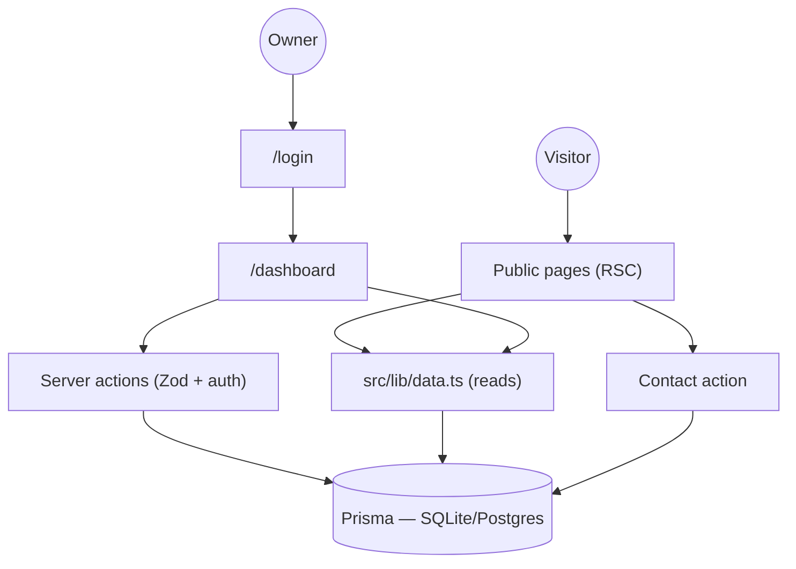

# Designer Portfolio

      

**A high-impact, spatial portfolio gallery with precision minimalism and cinematic storytelling — public showcase plus an owner dashboard, in one Next.js app.**

The public site opens on a cinematic hero: the designer's name in oversized display type beside a floating "constellation" of project imagery with animated cobalt markers and a typewriter meta line, over a faint sage six-column grid. Selected Works render as alternating editorial rows with sticky parallax imagery and giant ghost numbering (01/06), followed by a design-philosophy statement and the giant ghost-type footer marquee. A rotating radial menu overlays the whole site, and a persistent "Start a Project →" affordance anchors the bottom-right corner. Case-study pages pair full-bleed heroes with a sticky intro column and a zoomable 1↔2-column gallery (autoplaying muted video where present). Behind `/login`, an owner dashboard manages the project catalog and triages incoming inquiries. Every mutation is Zod-validated on the server, every session is database-backed, and the whole thing runs on a zero-config SQLite file that upgrades to PostgreSQL by changing two lines.

## Screenshots

Captured from the running app (see `docs/screenshots/` — 16 shots covering every page, both themes, desktop + mobile, and the radial menu):

| | | |
|---|---|---|
| `01-landing-light.png` — constellation hero | `02-landing-dark.png` — dark hero | `13-landing-works.png` — sticky parallax rows |
| `14-landing-footer-marquee.png` — ghost marquee | `16-radial-menu.png` — radial wheel overlay | `03-projects.png` — archive |
| `07-project-detail.png` — full-bleed case study | `15-project-detail-gallery.png` — gallery + zoom | `04-about.png` — portrait + timeline |
| `05-contact.png` — underline form | `06-login.png` — sign-in | `08–10` — dashboard views |
| `11-mobile-landing.png` — 390px hero | `12-mobile-menu.png` — mobile menu | |

## Key Features

| | Feature | Where |
|---|---|---|
| 🖼️ | Landing: constellation hero (floating project imagery + typewriter meta), alternating sticky-parallax Selected Works rows, philosophy, ghost-type footer marquee | `src/app/(site)/page.tsx` |
| 🧭 | Fixed overlay chrome: breathing A/M logo, center theme toggle, bottom-right "Start a Project →" CTA, rotating radial menu with project previews | `src/components/site/{site-header,radial-menu}.tsx` |
| 🗺️ | Projects archive with invert-fill hover rows, cursor-following previews, mobile imagery | `src/app/(site)/projects` |
| 📖 | Case-study pages: full-bleed hero, sticky intro + 1↔2-column zoomable gallery (incl. autoplay video), wrapped prev/next | `src/app/(site)/project/[slug]` |
| 📝 | About: portrait, experience timeline, sage-dot skills matrix | `src/app/(site)/about` |
| ✉️ | Contact: underline-style inquiry form (Zod + honeypot + rate limit), FAQ accordion, info columns | `src/app/(site)/contact` |
| 🔐 | Credentials auth: scrypt hashing, DB-backed sessions, signed HttpOnly cookie | `src/lib/auth/` |
| 📊 | Owner dashboard: stats overview, projects CRUD, inquiry triage workflow | `src/app/dashboard/` |
| 🌗 | Light/dark themes; reduced-motion aware | `next-themes` + `globals.css` |
| ♿ | Semantic landmarks, focus states, AA contrast, keyboard operability | throughout |
| 🧪 | Vitest unit suites (validation, hashing, JSON parsing, typewriter, constellation, menu geometry) + Playwright E2E (6 spec files, 30 tests) | `tests/`, `e2e/` |

## Quick Start

Prerequisites: **Node.js ≥ 20** (or Bun ≥ 1.1), and nothing else — the database is a file.

```bash
git clone https://github.com/nordeim/designer-portfolio.git
cd designer-portfolio
bun install                       # or: npm install
cp .env.example .env              # set AUTH_SECRET + SEED_ADMIN_PASSWORD (see below)
bun run db:push                   # create the SQLite schema
bun run db:seed                   # seed 5 projects + the OWNER account
bun run dev                       # → http://localhost:3000
```

Set these in `.env` before seeding:

```bash
AUTH_SECRET="$(openssl rand -base64 32)"      # signs session cookies
SEED_ADMIN_PASSWORD="at-least-8-chars"        # first-boot owner password
```

**Verify setup**

```bash
curl -s localhost:3000/api/health            # {"status":"ok","db":true,...}
bun run lint && bun run typecheck && bun run test   # all green
# E2E (optional; needs a running server + the seeded admin password):
E2E_ADMIN_PASSWORD="your-seed-password" bunx playwright test
```

Open http://localhost:3000 — the landing page shows the seeded catalog (Kinto, The Blue Shift, ST.Lab, …). Sign in at `/login` with `ADMIN_EMAIL` + the seeded password to reach `/dashboard`.

Production: `bun run build && bun run start`.

## Architecture

| Layer | Technology | Version | Purpose |
|---|---|---|---|
| Framework | Next.js (App Router, RSC, Turbopack) | 16.1.3 | SSR pages, Server Actions for mutations |
| UI runtime | React | 19.2.3 | Server Components by default |
| Language | TypeScript (strict) | 5.9.3 | End-to-end types |
| Styling | Tailwind CSS (`@theme` tokens) | 4.1.18 | CSS-first design system |
| Components | Radix primitives, shadcn-style, Lucide | current | Accessible interactive UI |
| Motion | Framer Motion | 12.26.2 | Menu, previews, gallery reveals |
| Database | SQLite (file) — PostgreSQL-portable | — | Single source of truth |
| ORM | Prisma | 6.19.2 | Typed schema, push-based migrations |
| Validation | Zod | 4.3.5 | Every action/route boundary |
| Auth | Custom: scrypt + DB sessions | — | No third-party auth dependency |
| Testing | Vitest · Playwright | 3.2.7 · 1.58 | Unit suites for pure domain logic + browser E2E |



Reads flow through RSC pages → `src/lib/data.ts` → Prisma. Mutations flow through Server Actions (`ActionResult` envelope, Zod validation, session authorization, tag revalidation) → Prisma.

## File Hierarchy

```
📂 src
 ├─ 📂 app
 │  ├─ 📂 (site)              Public routes with shared header/footer
 │  │  ├─ 📄 page.tsx         Landing — hero, selected works, philosophy
 │  │  ├─ 📂 project/[slug]   Case-study page (generateStaticParams)
 │  │  └─ 📂 projects, about, contact, privacy, accessibility
 │  ├─ 📂 (auth)/login        Credentials sign-in
 │  ├─ 📂 dashboard           Auth-gated: overview, projects CRUD, inquiries
 │  ├─ 📄 api/health/route.ts Liveness + DB readiness probe
 │  ├─ 📄 sitemap.ts, robots.ts, not-found.tsx, icon.svg
 │  └─ 📄 layout.tsx, globals.css   Fonts, theme provider, design tokens
 ├─ 📂 actions                ALL mutations ("use server", Zod, ActionResult)
 ├─ 📂 components
 │  ├─ 📂 site                Header/radial menu, constellation hero, works rows, philosophy, ghost marquee footer, project index, detail body, inquiry form
 │  ├─ 📂 dashboard           Shell/sidebar, projects manager, inquiries manager, forms
 │  └─ 📂 ui                  shadcn/Radix primitives
 └─ 📂 lib
    ├─ 📄 data.ts             Read-side queries
    ├─ 📄 validation.ts       Zod schemas + JSON-column helpers
    ├─ 📄 typewriter.ts       Pure typewriter state machine (unit-tested)
    ├─ 📄 constellation.ts    Pure constellation layout derivation (unit-tested)
    ├─ 📄 site-config.ts      Brand copy, links, FAQ, skills content
    └─ 📂 auth/               password.ts (scrypt), session.ts (DB sessions)
📂 prisma
 ├─ 📄 schema.prisma          User, Session, Project, Inquiry
 └─ 📄 seed.ts                Idempotent seed (5 projects + owner)
📂 public/projects/<slug>/    Optimized project media (11 MB total, incl. 1 video)
📂 tests                      Vitest suites (validation, password, typewriter, constellation, menu-wheel)
📂 e2e                        Playwright specs (public pages, project detail, auth, inquiry, dashboard, a11y)
📄 .env.example               Documented env manifest
```

## Environment Variables

| Variable | Purpose | Required |
|---|---|---|
| `DATABASE_URL` | SQLite path or PostgreSQL connection string | ✅ |
| `AUTH_SECRET` | Session-cookie signing key (`openssl rand -base64 32`) | ✅ in prod |
| `ADMIN_EMAIL` | Seed owner email (default `admin@alexmoreau.design`) | optional |
| `SEED_ADMIN_PASSWORD` | First-boot owner password (min 8 chars) | first seed |
| `NEXT_PUBLIC_SITE_URL` | Canonical origin for metadata/sitemap/robots | ✅ in prod |
| `GOOGLE_CLIENT_ID` / `GOOGLE_CLIENT_SECRET` | OAuth (login shows honest "not configured" notice when unset) | optional |
| `E2E_ADMIN_EMAIL` / `E2E_ADMIN_PASSWORD` | Playwright login credentials (auth/dashboard specs skip when unset) | optional |
| `E2E_START` / `E2E_COMMAND` / `E2E_PORT` / `E2E_BASE_URL` | Playwright server-management knobs | optional |

## Testing

```bash
bun run test                                   # all unit suites (42 tests)
bunx vitest run tests/validation.test.ts       # single file
bunx vitest run -t "rejects a slug"            # single test

E2E_ADMIN_PASSWORD=… bunx playwright test       # all e2e (30 tests; server on :3000)
bunx playwright test e2e/auth.spec.ts          # single spec file
```

**Unit (Vitest, 42 tests)**: inquiry/login/project Zod schemas (valid input, boundary values, invalid input, unknown enum values), scrypt hashing round-trips + malformed stored hashes, JSON-column parse degradation, typewriter state machine (typing/pausing/cycling), constellation layout derivation (positions/sizes/contain flags), radial-menu angle math (rotation clamping, counter-rotation). Password tests do real key derivation (~200 ms each).

**E2E (Playwright, 30 tests across 6 files)**: public page content + console cleanliness, project detail (hero labels, sticky intro, gallery zoom toggle, prev/next wrap-around, autoplaying video, 404), auth (login affordances, invalid credentials, dashboard gating, radial menu open/Escape), inquiry submission → dashboard inbox, dashboard flows (CRUD round-trip verified on the public site, inquiry triage, sign-out), a11y smoke (focus visibility, theme toggle, mobile overflow, marquee animation, constellation rendering). Mutating specs use unique payloads and clean up after themselves. On RAM-constrained hosts (< ~6 GB), run the suite against the production build (`E2E_START=1 E2E_COMMAND="bun run start"`) — the Turbopack dev server + Chromium together can exceed the memory budget.

## Design System

Defined once in `src/app/globals.css` (Tailwind v4 tokens + CSS custom properties):

| Token | Value | Usage |
|---|---|---|
| `--background` | `hsl(0 0% 96.5%)` / dark `7%` | Page paper (#F6F6F6) / ink (#121212) |
| `--foreground` | `hsl(0 0% 7%)` / dark `96.5%` | Primary text |
| `--cobalt` | `#2E5BFF` (light & dark) | Interactive accent — hovers, links, dots, focus |
| `--sage` | `#A3B18A` | Ghost grid lines + skills dots |
| `--border` | `hsl(0 0% 85%)` / dark `18%` | Hairline rules, editorial grid |
| `--radius` | `0` | Sharp editorial corners |

Typography: **Inter** (300–700, body/display; hero h1 scales 106 → 141px → 9.8vw at ≥1440px) · **JetBrains Mono** (300–500, the `label-mono` micro-label style — 12–14px, 0.1em tracking, uppercase; ghost marquee up to 96px `font-light`). Motion: 60s marquee, breathing logo (letter-spacing 0.05em ↔ 0.7em), gradient-shift on the "All Projects →" link — all `prefers-reduced-motion` aware; Framer transitions on menu/rows/gallery with `ease-out-expo`.

## Project Status

| Phase | Status | Key Deliverables |
|---|---|---|
| 1 — Public portfolio | ✅ Complete | Landing, projects, case studies, about, contact, legal pages, SEO (sitemap/robots/metadata) |
| 1 — Owner dashboard | ✅ Complete | Auth, overview, projects CRUD, inquiry triage |
| 2 — Polish | ✅ Complete | Dark mode, a11y pass, image optimization, rate limiting, honeypot |
| 3 — Optional integrations | ⬜ Deferred | Google OAuth (UI present, honest unconfigured state), SMTP notifications |

## Troubleshooting

| Issue | Solution |
|---|---|
| `Cannot read properties of undefined (reading 'findMany')` | Prisma client is stale — restart `bun run dev` after schema edits (`db:generate` + `db:push` first) |
| Turbopack `Failed to restore task data` | Corrupted cache — delete `.next/` and restart the dev server |
| One route hangs while `/api/health` is 200 | Hung route compile — restart and clear `.next/` |
| `EADDRINUSE :::3000` | `lsof -ti:3000 \| xargs -r kill -9` **plus** `pkill -9 -f next-server` (the standalone server renames its process; take the PID from `ss -tlnp \| grep :3000` when in doubt) |
| Playwright fails with connection-refused mid-run on a small host | The kernel OOM-killed the dev server (Turbopack ~2.3 GB + Chromium ~2 GB). Run the suite against the production build: `bun run build && E2E_START=1 E2E_COMMAND="bun run start" bunx playwright test` |
| Seed refuses to create owner | `SEED_ADMIN_PASSWORD` unset or shorter than 8 chars — set it and re-run `bun run db:seed` |
| Login says "Invalid email or password" | 5 attempts / 10 minutes per email (in-memory throttle); verify the seeded password hash with a fresh DB |
| Images 404 on a fresh clone | Media ships in `public/projects/` — ensure it wasn't excluded by a partial clone or LFS config |
| Page edits don't show up | Server-action routes revalidate on mutation; for hand-edited DB rows, restart dev (RSC caching) |
